# Quasar - Learn

整理我学习Quasar的笔记，网上大多文章都是旧版本的Quasar，有很多命令（如 `quasar init` ）已经弃用了，并且目录结构也有些许不一样（配置文件从 `quasar.conf.js` 变成了 `quasar.config.js` 等）。最新版本的英文文档，我一开始点进去他就直接介绍组件、api，一脸懵逼，不是特别友好。因此，本文档梳理了各种搜集到的文章，主要结合官方英文文档，重新排版一份我自己的入门学习笔记。

本笔记主要贡献：

+ 整理各类参考文献，整合成易于快速上手的本文

+ 优化官方文档的中文译文（网上很多文章机翻味道太重，有些机翻干扰理解，为此我重新翻译了一些地方）
  + 直接阅读英文原文其实更加方便理解，译文没有原文表达的清楚
+ 补充扩展一些概念（如 I18n 等，遇到我不熟悉的概念，会查阅补上笔记）
+ 自己个人的一些理解（不一定完全正确，请自己斟酌取舍）
+ etc

请直接从 <a href="#start"> 安装 Quasar</a> 这节开始阅读，前面几节踩坑记录。

**Presented By R.G.**

**Begin on 2022.05.18**

## Quasar 初体验

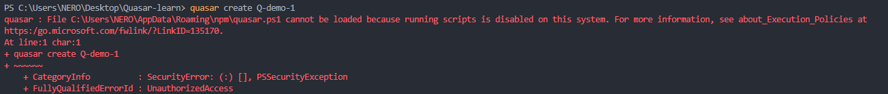

https://docs.microsoft.com/zh-cn/powershell/module/microsoft.powershell.core/about/about_execution_policies?view=powershell-7.2

```powershell
PS C:\Users\NERO\Desktop\Quasar-learn> Get-ExecutionPolicy
Restricted
PS C:\Users\NERO\Desktop\Quasar-learn> Get-ExecutionPolicy -List

        Scope ExecutionPolicy
        ----- ---------------
MachinePolicy       Undefined
   UserPolicy       Undefined
      Process       Undefined
  CurrentUser       Undefined
 LocalMachine       Undefined
```

配置

https://blog.csdn.net/weixin_37493499/article/details/108930327

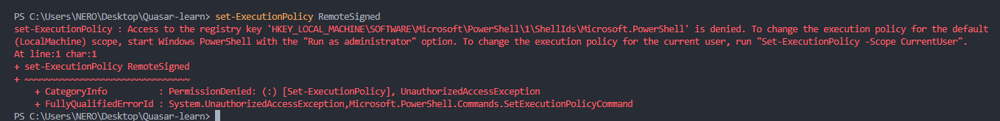

不可行

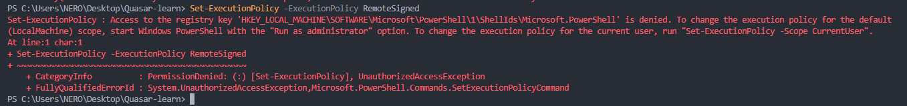

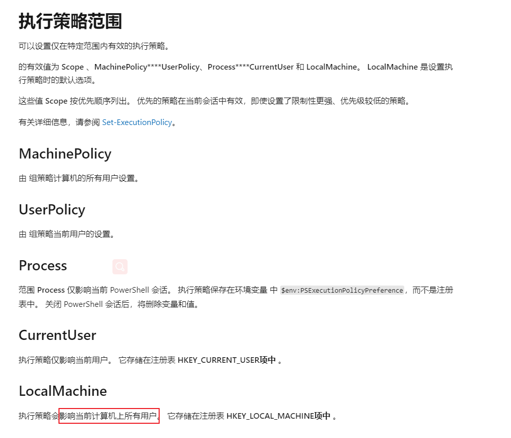

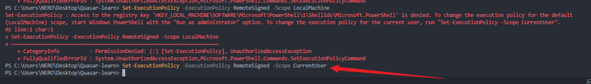

估计是公司机子有权限，那就把策略范围设置到当前用户上

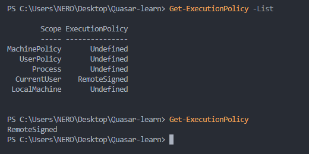

再试一下

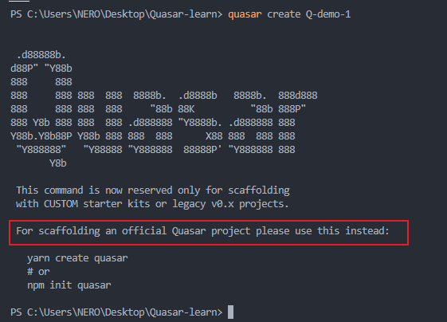

可以了，不过命令变了（我一开始看到的都是旧版本的资料）

```powershell
npm init quasar
```


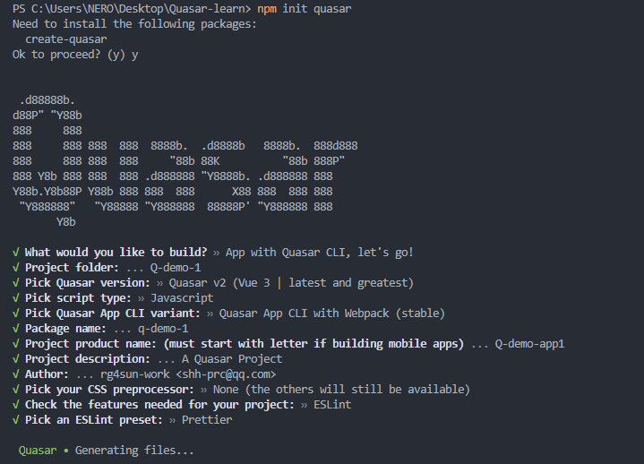

生成如下项目文件夹

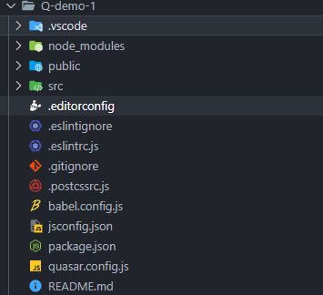

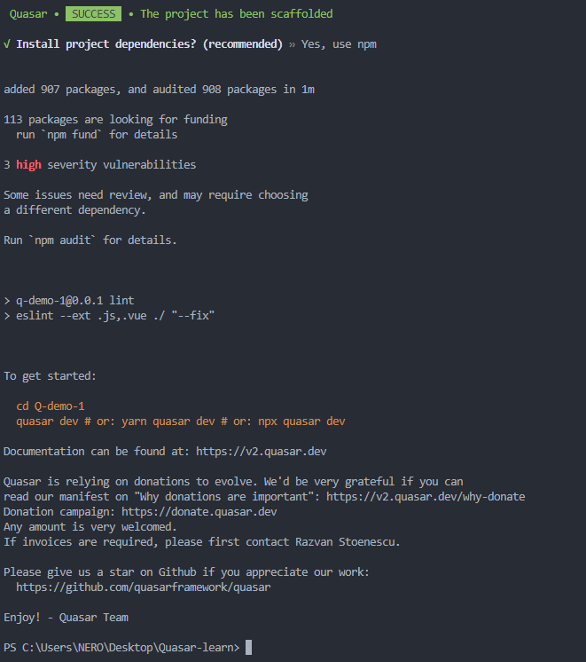

记得创建项目后，cd 进去（同时VSCode打开的根路径要是项目根路径），不然不在项目根路径下，很多 config 识别不到的

测试启动默认quasar样例：

```shell
quasar dev
```

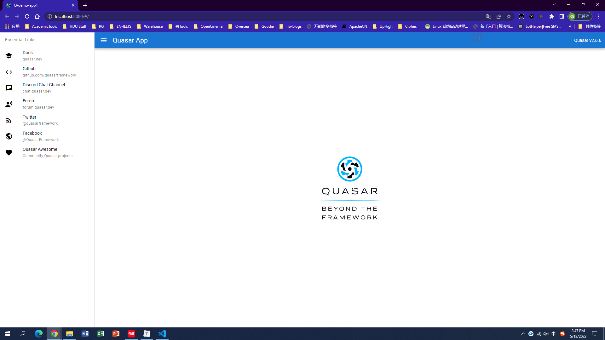


## Quasar 项目结构 （旧版本）

> 如果你是初学者，你需要关心的是`/quasar.config.js`（Quasar App配置文件）、`/src/router`、`/src/layouts`、`/src/pages`和可选的`/src/assets`。

```powershell
.
├── public/                  # 纯静态资源（直接复制）
├── src/
│   ├── assets/              # 动态资源（由webpack处理）
│   ├── components/          # 用于页面和布局的.vue组件
│   ├── css/                 # CSS/Stylus/Sass/...文件【里面具体是啥，看你选哪个css预处理器】
|   |   ├── app.styl
|   │   └── quasar.variables.styl # 供您调整的Quasar Stylus变量
│   ├── layouts/             # 布局 .vue 文件
│   ├── pages/               # 页面 .vue 文件
│   ├── boot/                # 启动文件 (应用初始化代码) 
│   ├── router/              # Vue路由
|   |   ├── index.js         # Vue路由定义
|   │   └── routes.js        # App路由定义
│   ├── store/               # Vuex Store
|   |   ├── index.js         # Vuex Store 定义
|   │   ├── <folder>         # Vuex Store 模块...
|   │   └── <folder>         # Vuex Store 模块...
│   ├── App.vue              # APP的根Vue组件
│   └── index.template.html  # index.html模板
├── src-ssr/                 # SSR特定代码(就像生产环境的Node网页服务器)
├── src-pwa/                 # PWA特定代码（如Service Worker）
├── src-cordova/             # Cordova生成的文件夹用于创建移动APP
├── src-electron/            # Electron特定代码（如"main"线程)
├── src-bex/                 # BEX（浏览器扩展）特定代码（如"main"线程)
├── dist/                    # 生产版本代码，用于部署
│   ├── spa/                 # 构建SPA的例子
│   ├── ssr/                 # 构建SSR的例子
│   ├── electron/            # 构建Electron的例子
│   └── ....
├── quasar.conf.js           # Quasar App配置文件
├── babel.config.js          # Babeljs配置
├── .editorconfig            # editor配置
├── .eslintignore            # ESlint忽略路径
├── .eslintrc.js             # ESlint配置
├── .postcssrc.js            # PostCSS配置
├── .stylintrc               # Stylus lint配置
├── .gitignore               # GIT忽略路径
├── package.json             # npm脚本和依赖项
└── README.md                # 您的网站/应用程序的自述文件
```

> 参考：[quasar 参考文档 ](https://www.cnblogs.com/q1104460935/p/15663108.html) 【旧版本了，新版本请看后文】

<a name="start"></a>

## 安装 Quasar

```shell
# 全局安装 脚手架
npm i -g @quasar/cli
```

## 创建 Quasar 项目

```
npm init quasar
# 以下为旧版本命令，已弃用
# -------------------
quasar init <folder-name>
quasar create <folder-name>
```

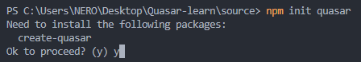

之后就是一些项目配置选项了

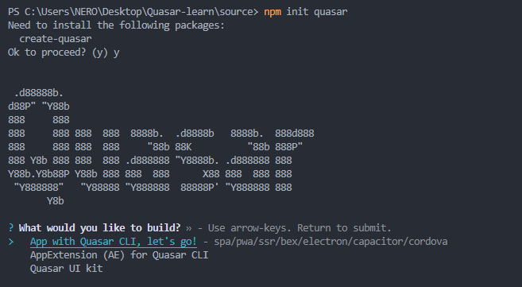

```
? What would you like to build? » - Use arrow-keys. Return to submit.
>   App with Quasar CLI, let's go! - spa/pwa/ssr/bex/electron/capacitor/cordova 👈 创建此些类型项，见下文介绍
>   AppExtension (AE) for Quasar CLI - Quasar CLI AE 👈 开发 Quasar CLI 插件（扩展应用）
>   Quasar UI kit - Vue component and/or directive 👈 开发 Vue组件或指令
```

### Quasar 支持创建的几种类型的web应用

Quasar的理念是：**一站式所有平台**，即一次性编写代码，并同时将其部署为网站，移动应用程序和应用程序。 一个适用于所有代码的代码库，可通过Quasar Web复用组件，会帮助您在创纪录的时间内开发应用程序。

> 主要看 ※ 标记的两个类型，目前对这俩有需求

#### ※ SPA（Single-Page Application，单页应用程序/网站）

> <u>A **Single-Page Application (SPA)** is a web application or web site that interacts with the user by ***dynamically rewriting the current page rather than loading entire new pages from a server***.</u> This approach avoids interruption of the user experience between successive pages, making the application ***behave more like a desktop application***.
>
> ——[Quasar - What is SPA](https://quasar.dev/quasar-cli-vite/developing-spa/introduction#introduction)
>
> 
>
> **单页Web应用（single page web application，SPA）**，就是只有一张Web页面的应用。单页应用程序 (SPA) 是加载单个HTML 页面并在用户与应用程序交互时动态更新该页面的Web应用程序。  浏览器一开始会加载必需的HTML、CSS和JavaScript，所有的操作都在这张页面上完成，都由JavaScript来控制。因此，对单页应用来说模块化的开发和设计显得相当重要。
>
> —— https://baike.baidu.com/item/SPA/17536313

#### PWA（Progressive Web App, 渐进式Web应用）

> <u>A **Progressive Web App (PWA)** is a web app that uses modern web capabilities to deliver an ***app-like experience*** to users.</u> These apps meet certain requirements (see below), are deployed to web servers and accessible through URLs (on HTTPS protocol).
>
> This can work in conjunction with Cordova to provide a multiple deploy targets for all your users. Quasar CLI allows you to deploy your app as a PWA as well as a Mobile app and take advantage of both channels.
>
> ——[Quasar - What is a PWA](https://quasar.dev/quasar-cli-vite/developing-pwa/introduction#introduction)
>
> 
>
> PWA（Progressive Web Apps，渐进式 Web 应用）运用现代的 Web API 以及传统的渐进式增强策略来创建跨平台 Web 应用程序。这些应用无处不在、功能丰富，使其具有与原生应用相同的用户体验优势。这组文档和指南告诉您有关 PWA 的所有信息。
>
> —— [MDN - 渐进式 Web 应用（PWA）](https://developer.mozilla.org/zh-CN/docs/Web/Progressive_web_apps) 👈 关于PWA的所有概念都在这里
>
> 
>
> PWA 不是只使用一种技术创建的。**它代表了构建 Web 应用程序的新理念**，涉及一些特定的模式，API 和其他功能。**一眼是看不出来一个 Web App 是不是 PWA 的。**如果应用程序满足某些要求，或者实现了一组特定的功能，例如离线工作、可安装、易于同步、可以发送推送通知等，我们就可以将其视为 PWA。
>
> 辨别一个 Web 应用是否是 PWA 有一些关键原则。一个 PWA 应该具有以下特点：
>
> - [可发现（Discoverable）](https://developer.mozilla.org/en-US/docs/Web/Progressive_web_apps/Introduction#Advantages_of_web_applications#discoverable), 可以通过搜索引擎发现。
> - [可安装（Installable）](https://developer.mozilla.org/en-US/docs/Web/Progressive_web_apps/Introduction#Advantages_of_web_applications#installable), 可以出现在设备的主屏幕。
> - [可链接（Linkable）](https://developer.mozilla.org/en-US/docs/Web/Progressive_web_apps/Introduction#Advantages_of_web_applications#linkable), 可以简单地通过 URL 分享。 
> - [独立于网络（Network independent）](https://developer.mozilla.org/en-US/docs/Web/Progressive_web_apps/Introduction#Advantages_of_web_applications#network_independent), 可以在离线状态或者是在网速很差的情况下运行。
> - [渐进式（Progressive）](https://developer.mozilla.org/en-US/docs/Web/Progressive_web_apps/Introduction#Advantages_of_web_applications#progressive), 在老版本的浏览器仍旧可以使用，在新版本的浏览器上可以使用全部功能。
> - [可重入（Re-engageable）](https://developer.mozilla.org/en-US/docs/Web/Progressive_web_apps/Introduction#Advantages_of_web_applications#re-engageable), 无论何时有新的内容，都可以发送通知。
> - [响应式（Responsive）](https://developer.mozilla.org/en-US/docs/Web/Progressive_web_apps/Introduction#Advantages_of_web_applications#responsive), 在任何具有屏幕和浏览器的设备上可以正常使用——包括手机、平板电脑、笔记本、电视、冰箱等。
> - [安全（Safe）](https://developer.mozilla.org/en-US/docs/Web/Progressive_web_apps/Introduction#Advantages_of_web_applications#safe), 在用户、应用和服务器之间的连接是安全的，第三方无法访问你的敏感数据。
>
> ——[渐进式 Web 应用介绍](https://developer.mozilla.org/zh-CN/docs/Web/Progressive_web_apps/Introduction)
>
> <a name="ssr"></a>
>
> **渲染网站主要有两种方法 - 在服务器上或在客户端上。**它们都有其优点和缺点，你可以适当地混合使用这两种方法
>
> - **服务器端渲染（Server-Side Rendering, SSR）**的意思是在服务器上渲染网页，因此首次加载会更快，但是在不同页面之间导航都需要下载新的HTML内容。它的跨浏览器兼容性良好，但代价是页间加载时间延长，也就是总体感知上的性能降低：每加载一个页面，都需要一个服务器请求往返的时间。
> - **客户端渲染（Client-Side Rendering, CSR）**允许在导航到不同页面时几乎立即在浏览器中更新网站，但在开始时需要更多的初始下载和客户端上的额外渲染。 首次访问时网站速度较慢，但后续访问速度要快得多。
>
> 将 SSR 与 CSR 混用可以获得最佳效果：您可以在服务器上渲染网站，缓存其内容，然后在客户端需要时更新渲染。因为使用了 SSR，第一页加载很快；因为客户端可以仅使用已更改的部分重新渲染页面，所以页面之间的导航也是平滑的。
>
> ——[PWA 结构](https://developer.mozilla.org/zh-CN/docs/Web/Progressive_web_apps/App_structure)

#### ※ SSR(Server-Side Rendering, 服务器端渲染)

> ==Quasar and Vue.js are frameworks for building **client-side** applications==. By default, Quasar Vue components produce and manipulate DOM in the browser as output. <u>However, it is **also possible to render the same components into HTML strings on the server**, send them directly to the browser, and finally “hydrate” the static markup into a fully interactive app on the client.</u>
>
> A **server-rendered Quasar app** can also be considered `isomorphic` or `universal`, in the sense that the majority of **your app’s code runs on both the server and the client.**
>
> ——[Quasar - What is SSR](https://quasar.dev/quasar-cli-vite/developing-ssr/introduction#introduction)
>
> 
>
> - SSR（服务器端渲染应用程序）（+可选的PWA客户端接管）
>
> **服务器端渲染（SSR）**的意思是在服务器上渲染网页，因此首次加载会更快，但是在不同页面之间导航都需要下载新的HTML内容。它的跨浏览器兼容性良好，但代价是页间加载时间延长，也就是总体感知上的性能降低：每加载一个页面，都需要一个服务器请求往返的时间。
>
> 更多关于 SSR的介绍，可以参考 [Vue -  服务端渲染指南](https://v3.cn.vuejs.org/guide/ssr/introduction.html)
>
> 与之对应的就是 **客户端渲染（CSR）**，回顾 <a href="#ssr">这里</a>

#### BEX（Browser Extension，浏览器扩展）

> <u>A **Browser Extension (BEX)** is an application that runs in the browsers context and is used to customize the web browser in some way.</u>
>
> They are built on web technologies such as HTML, JavaScript, and CSS and will aim to fulfill a single purpose. A single BEX can be built in any way the user deems fit but must contribute towards fulfilling that single purpose.
>
> Here a few things a BEX can do:
>
> - Override page content
> - Add to (or alter) the browser’s interface
> - Intercept page requests
> - Be a full featured app that runs in the browser.
> - Interact with and alter the development tools of the browser.
>
> We’ve all used Browser Extensions in some capacity. Quasar BEX allows you to do anything a browser extension allows but with the simplicity Quasar offers in all other modes.
>
> —— [Quasar - What is a Browser Extension](https://quasar.dev/quasar-cli-vite/developing-browser-extensions/introduction)
>
> 
>
> 扩展或者说是附加组件，拥有可以修改、增强浏览器的能力。
>
> ——[MDN - 浏览器扩展](https://developer.mozilla.org/zh-CN/docs/Mozilla/Add-ons/WebExtensions)
>
> 可以参考这篇文章：[用Vue实现一个谷歌浏览器搜索扩展](https://zhuanlan.zhihu.com/p/355864607) 👈 用了Quasar

#### Electron应用（桌面应用程序）

> [Electron](https://electronjs.org/) (formerly known as Atom Shell) is an open-source framework created by Cheng Zhao, and now developed by GitHub. <u>**It allows for the development of ==desktop GUI applications==** using front and back end components originally developed for web applications: **Node.js runtime for the backend** and **Chromium for the frontend**.</u> Electron is the main GUI framework behind several notable open-source projects including GitHub’s Atom and Microsoft’s Visual Studio Code source code editors, the Tidal music streaming service desktop application and the Light Table IDE, in addition to the freeware desktop client for the Discord chat service.
>
> Each Electron app has two threads: one is the main thread (dealing with the App window and bootup), and one is the renderer thread (which is basically your UI web code). There is also a preload script to bridge the two “worlds”.
>
> ——[Quasar - What is Electron](https://quasar.dev/quasar-cli-vite/developing-electron-apps/introduction)
>
> 
>
> VS Code 就是用 Electron 开发的哦~

#### 移动APP

> Quasar offers two solutions for creating mobile apps:
>
> - **Capacitor** was created by Ionic Framework as a more modern replacement for Cordova. It supports most, but not all, Cordova plugins as well as Capacitor-specific plugins.
> - **Cordova** is a mobile application development framework originally created by Nitobi. Adobe Systems purchased Nitobi in 2011, rebranded it as PhoneGap, and later released an open source version of the software called Apache Cordova.

##### 借助 Capacitor 开发移动应用

> [Capacitor](https://capacitorjs.com/) is a **cross-platform native runtime for *deploying web applications to mobile***. It is maintained by [Ionic](https://ionic.io/) and designed as a modern successor to Cordova. It supports most, but not all Cordova plugins, as well as Capacitor-specific plugins (called APIs). It exposes native device APIs in the form of JavaScript modules.
>
> ——[Quasar - What is Capacitor](https://quasar.dev/quasar-cli-vite/developing-capacitor-apps/introduction#introduction)

##### 借助 Cordova 开发移动应用

> Apache **Cordova is a *mobile application* development framework** originally created by Nitobi. Adobe Systems purchased Nitobi in 2011, rebranded it as PhoneGap, and later released an open source version of the software called Apache Cordova.
>
> [Apache Cordova](https://cordova.apache.org/) enables software programmers to build applications for mobile devices using CSS3, HTML5, and JavaScript instead of relying on platform-specific APIs like those in Android, iOS, or Windows Phone. It enables wrapping up of CSS, HTML, and JavaScript code depending upon the platform of the device. It extends the features of HTML and JavaScript to work with the device. The resulting applications are hybrid, meaning that they are neither truly native mobile application (because all layout rendering is done via Web views instead of the platform’s native UI framework) nor purely Web-based (because they are not just Web apps, but are packaged as apps for distribution and have access to native device APIs).
>
> You can hook into the native device APIs by using [Cordova Plugins](https://quasar.dev/quasar-cli-vite/developing-cordova-apps/cordova-plugins).
>
> ——[Quasar - What is Cordova](https://quasar.dev/quasar-cli-vite/developing-cordova-apps/introduction)


## Quasar 项目结构（最新版本）

> 如果你是初学者，你需要关心的是`/quasar.config.js`（Quasar App配置文件）、`/src/router`、`/src/layouts`、`/src/pages`和`/src/assets`，其他比较重要的文件和 Vue 项目一致，就不特别标注了。
>
> 我用 🍀 标记出来

```shell
.
├── public/                  # pure static assets (directly copied)
├── src/
│   ├── assets/              # dynamic assets (processed by webpack) 🍀
│   ├── components/          # .vue components used in pages & layouts
│   ├── css/                 # CSS/Sass/... files for your app
|   |   ├── app.sass
|   │   └── quasar.variables.sass # Quasar Sass variables for you to tweak
│   ├── layouts/             # layout .vue files 🍀
│   ├── pages/               # page .vue files 🍀
│   ├── boot/                # boot files (app initialization code) 这个在旧版本是 plugins/ 文件夹
│   ├── router/              # Vue Router 🍀
|   |   ├── index.js         # Vue Router definition
|   │   └── routes.js        # App Routes definitions
│   ├── stores/              # Pinia Stores (if not using Vuex)
|   |   ├── index.js         # Pinia initialization
|   │   ├── <store>          # Pinia stores...
|   │   └── <store>...
│   ├── store/               # Vuex Store (if not using Pinia)
|   |   ├── index.js         # Vuex Store definition
|   │   ├── <folder>         # Vuex Store Module...
|   │   └── <folder>         # Vuex Store Module...
│   ├── App.vue              # root Vue component of your App
│   └── index.template.html  # Template for index.html
├── src-ssr/                 # SSR specific code (like production Node webserver)
├── src-pwa/                 # PWA specific code (like Service Worker)
├── src-cordova/             # Cordova generated folder used to create Mobile Apps
├── src-electron/            # Electron specific code (like "main" thread)
├── src-bex/                 # BEX (browser extension) specific code (like "main" thread)
├── dist/                    # where production builds go
│   ├── spa/                 # example when building SPA
│   ├── ssr/                 # example when building SSR
│   ├── electron/            # example when building Electron
│   └── ....
├── quasar.config.js           # Quasar App Config file 🍀
├── babel.config.js          # Babeljs config
├── .editorconfig            # editor config
├── .eslintignore            # ESlint ignore paths
├── .eslintrc.js             # ESlint config
├── .postcssrc.js            # PostCSS config
├── .gitignore               # GIT ignore paths
├── package.json             # npm scripts and dependencies
└── README.md                # readme for your website/App
```


## Quasar CLI 基础命令

### help 帮助命令

```shell
PS C:\Users\NERO\Desktop\Quasar-learn\source\Q-demo-1> quasar help


 .d88888b.
d88P" "Y88b
888     888
888     888 888  888  8888b.  .d8888b   8888b.  888d888
888     888 888  888     "88b 88K          "88b 888P"
888 Y8b 888 888  888 .d888888 "Y8888b. .d888888 888
Y88b.Y8b88P Y88b 888 888  888      X88 888  888 888
 "Y888888"   "Y88888 "Y888888  88888P' "Y888888 888
       Y8b

  Running @quasar/cli v1.3.2
  Running @quasar/app-webpack v3.5.1

  Example usage
    $ quasar <command> <options>

  Help for a command
    $ quasar <command> --help
    $ quasar <command> -h

  Options
    --version, -v Print Quasar App CLI version

  Commands
    dev, d        Start a dev server for your App
    build, b      Build your app for production
    clean, c      Clean all build artifacts
    new, n        Quickly scaffold page/layout/component/... vue file
    mode, m       Add/remove Quasar Modes for your App
    inspect       Inspect generated Webpack config
    ext, e        Manage Quasar App Extensions
    run, r        Run specific command provided by an installed
                    Quasar App Extension
    describe      Describe a Quasar API (component)
    test, t       Run @quasar/testing App Extension command
                    - requires @quasar/testing App Extension to be installed
                    - this is an alias command for convenience purposes
    info, i       Display info about your machine and your App
    help, h       Displays this message

  If the specified command is not found, then "quasar run"
  will be executed with the provided arguments.

  Commands supplied by @quasar/cli global installation:

    upgrade       Check (and optionally) upgrade Quasar packages
                    from a Quasar project folder
    serve         Create an ad-hoc server on App's distributables

```

### info 信息展示命令

```shell
PS C:\Users\NERO\Desktop\Quasar-learn\source\Q-demo-1> quasar info -h

  Description
    Displays information about your machine and your Quasar App.

  Usage
    $ quasar info

  Options
    --help, -h     Displays this message
```

### dev 开发服务器运行命令

```shell
PS C:\Users\NERO\Desktop\Quasar-learn\source\Q-demo-1> quasar dev -h

  Description
    Starts the app in development mode (hot-code reloading, error
    reporting, etc)

  Usage
    $ quasar dev
    $ quasar dev -p <port number>

    $ quasar dev -m ssr

    # alias for "quasar dev -m cordova -T ios"
    $ quasar dev -m ios

    # alias for "quasar dev -m cordova -T android"
    $ quasar dev -m android

    # passing extra parameters and/or options to
    # underlying "cordova" or "electron" executables:
    $ quasar dev -m ios -- some params --and options --here
    $ quasar dev -m electron -- --no-sandbox --disable-setuid-sandbox
    # when on Windows and using Powershell:
    $ quasar dev -m ios '--' some params --and options --here
    $ quasar dev -m electron '--' --no-sandbox --disable-setuid-sandbox

  Options
    --mode, -m       App mode [spa|ssr|pwa|cordova|capacitor|electron|bex] (default: spa)
    --port, -p       A port number on which to start the application
    --hostname, -H   A hostname to use for serving the application
    --help, -h       Displays this message

    Only for Cordova mode:
    --target, -T     (required) App target
                        [android|ios]
    --emulator, -e   (optional) Emulator name
                        Examples: iPhone-7, iPhone-X
                        iPhone-X,com.apple.CoreSimulator.SimRuntime.iOS-12-2
    --ide, -i        Open IDE (Android Studio / XCode) instead of letting Cordova
                        booting up the emulator, in which case the "--emulator"
                        param will have no effect

    --devtools, -d   Open remote Vue Devtools

    Only for Capacitor mode:
    --target, -T     (required) App target
                        [android|ios]
```

> Quasar开发服务器允许您通过编译和维护内存代码来开发您的应用程序。 一个Web服务器将为您的应用程序提供热备功能。 运行内存可以在更改代码时提供更快的重建速度。
>
> > Hot Reload不仅仅是在代码更改时刷新浏览器。 它会跳过刷新并在运行中更新您的代码，同时保持您的应用程序的状态（如您的Vue的模型数据）。 请注意，有些情况下这是不可能的，所以dev的网络服务器只会刷新你的浏览器。 （一定要确保一次只运行一个Quasar CLI实例，否则Hot-Reload和其他内容将会中断！）
>
> 根据您要开发的内容，您可以使用“quasar dev”命令启动开发服务器，如下所示：
>
> ```shell
> # Developing a SPA
> $ quasar dev
> # ...or
> $ quasar dev -m spa
> 
> # Developing a PWA
> $ quasar dev -m pwa
> 
> # Developing a Mobile App (through Cordova)
> $ quasar dev -m cordova -T [android|ios]
> 
> # Developing an Electron App
> $ quasar dev -m electron
> ```
>
> 但是，有两个主题可用：Material Design（’mat’）和iOS（’ios’）。 为了指定一个特定的主题，在上面的命令中添加’-t’参数：
>
> ```shell
> # Material Design
> $ quasar dev -t mat
> 
> # iOS theme
> $ quasar dev -t ios
> ```
>
> 如果您想更改为您的应用程序提供服务的主机名或端口，您有3个选项：
>
> - 编辑 ‘/quasar.conf.js’:
>
>   ```shell
>   devServer: {
>     host: '...',
>     port: ...
>   }
>   ```
>
> - 通过’-H’（主机名）和’-p’（端口）命令选项。
>
> - 如果这是一次性事情，请将主机名和/或端口指定为环境变量：
>
>   ```shell
>   $ PORT=3000 quasar dev
>   $ HOSTNAME=1.1.1.14 quasar dev
>   ```
>
> 如果似乎有热重载的问题，您可以尝试两个修补程序：
>
> - 更改项目文件夹的权限
>
>   ```shell
>   sudo chown -R username: .
>   ```
>
> - 或者以root权限运行开发服务器
>
>   ```shell
>   sudo quasar dev
>   ```
>
> —— [上古版本的quasar中文文档](http://v0-16.quasarchs.com/guide/quasar-cli.html)

### build 构建命令

```shell
PS C:\Users\NERO\Desktop\Quasar-learn\source\Q-demo-1> quasar build -h

  Description
    Builds distributables of your app.

  Usage
    $ quasar build
    $ quasar build -p <port number>

    $ quasar build -m ssr

    # alias for "quasar build -m cordova -T ios"
    $ quasar build -m ios

    # alias for "quasar build -m cordova -T android"
    $ quasar build -m android

    # passing extra parameters and/or options to
    # underlying "cordova" executable:
    $ quasar build -m ios -- some params --and options --here
    # when on Windows and using Powershell:
    $ quasar build -m ios '--' some params --and options --here

  Options
    --mode, -m      App mode [spa|ssr|pwa|cordova|capacitor|electron|bex] (default: spa)  
    --target, -T    App target
                      - Cordova (default: all installed)
                        [android|ios]
                      - Capacitor
                        [android|ios]
                      - Electron with default "electron-packager" bundler (default: yours)
                        [darwin|win32|linux|mas|all]
                      - Electron with "electron-builder" bundler (default: yours)
                        [darwin|mac|win32|win|linux|all]
    --publish, -P   Also trigger publishing hooks (if any are specified)
                      - Has special meaning when building with Electron mode and using    
                        electron-builder as bundler
    --debug, -d     Build for debugging purposes
    --skip-pkg, -s  Build only UI (skips creating Cordova/Capacitor/Electron executables)
                      - Cordova (it only fills in /src/cordova/www folder with the UI code)
                      - Capacitor (it only fills in /src/capacitor/www folder with the UI code)
                      - Electron (it only creates the /dist/electron/UnPackaged folder)
    --help, -h      Displays this message

    ONLY for Cordova and Capacitor mode:
    --ide, -i       Open IDE (Android Studio / XCode) instead of finalizing with a
                    terminal/console-only build

    ONLY for Electron mode:
    --bundler, -b   Bundler (electron-packager or electron-builder)
                      [packager|builder]
    --arch, -A      App architecture (default: yours)
                      - with default "electron-packager" bundler:
                          [ia32|x64|armv7l|arm64|mips64el|all]
                      - with "electron-builder" bundler:
                          [ia32|x64|armv7l|arm64|all]

    ONLY for electron-builder (when using "publish" parameter):
    --publish, -P  Publish options [onTag|onTagOrDraft|always|never]
                     - see https://www.electron.build/configuration/publish

```

> Quasar CLI可以将所有东西封装在一起，并优化您的应用程序进行生产。 它可以缩减源代码，提取供应商组件，利用浏览器缓存等等。
>
> ```shell
> # build for production
> $ quasar build
> 
> # build for production with specific theme
> $ quasar build -t mat
> $ quasar build -t ios
> $ quasar build -m pwa -t mat
> ```

### clean 清理构建命令

```shell
PS C:\Users\NERO\Desktop\Quasar-learn\source\Q-demo-1> quasar clean -h

  Description
    Cleans all build artifacts
  Usage
    $ quasar clean
  Options
    --help, -h     Displays this message

```

### mode 模式控制命令

```shell
PS C:\Users\NERO\Desktop\Quasar-learn\source\Q-demo-1> quasar mode -h

  Description
    Add/Remove support for PWA / BEX / Cordova / Capacitor / Electron modes.   

  Usage
    $ quasar mode [add|remove] [pwa|ssr|bex|cordova|capacitor|electron] [--yes]

    # determine what modes are currently installed:
    $ quasar mode

  Options
    --yes, -y     Skips the "Are you sure?" question
                  when removing a Quasar mode
    --help, -h    Displays this message

```

> 当您使用主入门套件时，您可以构建SPA（单页网站/应用程序），PWA（Progressive Web App），Mobile App（通过Cordova）和/或Electron Apps。当您开发PWA，Cordova或Electron时，需要安装这些模式。如果您发出“quasar dev”或“quasar build”，它们将自动安装。
>
> 这些模式将在您的项目中添加一个“src- *”文件夹，其中包含非常具体的代码：
>
> | 文件夹       | 模式     | 说明                                                         |
> | :----------- | :------- | :----------------------------------------------------------- |
> | src-pwa      | pwa      | 包含您可以调整的Service Worker文件。                         |
> | src-cordova  | cordova  | 是一个Cordova项目文件夹，将使用您的’src’作为内容。从此文件夹中调整Cordova配置，添加/删除平台，启动画面，Cordova插件等。不要触摸“src-cordova/www”文件夹，因为它会在每个版本中被覆盖。 |
> | src-electron | electron | 具有主电子线程的代码。渲染器线程将成为’src’中的应用程序。    |
>
> 如果由于某种原因您决定不需要某种模式，则可以将其删除。**这将永久删除**相应的“src-*”文件夹。
>
> ```shell
> $ quasar mode --remove pwa
> ```

### serve

```shell
PS C:\Users\NERO\Desktop\Quasar-learn\source\Q-demo-1> quasar serve -h

  Description
    Start a HTTP(S) server on a folder.

  Usage
    $ quasar serve [path]
    $ quasar serve . # serve current folder

    If you serve a SSR folder built with the CLI then
    control is yielded to /index.js and params have no effect.

  Options
    --port, -p              Port to use (default: 4000)
    --hostname, -H          Address to use (default: 0.0.0.0)
    --gzip, -g              Compress content (default: true)
    --silent, -s            Suppress log message
    --colors                Log messages with colors (default: true)
    --open, -o              Open browser window after starting
    --cache, -c <number>    Cache time (max-age) in seconds;
                            Does not apply to /service-worker.js
                            (default: 86400 - 24 hours)
    --micro, -m <seconds>   Use micro-cache (default: 1 second)

    --history               Use history api fallback;
                              All requests fallback to /index.html,
                              unless using "--index" parameter
    --index, -i <file>      History mode (only!) index url path
                              (default: index.html)

    --https                 Enable HTTPS
    --cert, -C [path]       Path to SSL cert file (Optional)
    --key, -K [path]        Path to SSL key file (Optional)
    --proxy <file.js>       Proxy specific requests defined in file;
                            File must export Array ({ path, rule })
                            See example below. "rule" is defined at:
                            https://github.com/chimurai/http-proxy-middleware
    --cors                  Enable CORS for all requests
    --help, -h              Displays this message

  Proxy file example
    module.exports = [
      {
        path: '/api',
        rule: { target: 'http://www.example.org' }
      }
    ]
    --> will be transformed into app.use(path, httpProxyMiddleware(rule))
```

> 构建SPA或PWA时，可分发的文件夹可由任何静态网络服务器提供服务。 为了测试它（假设您没有特定的publicPath或者没有使用Vue Router“history”模式），您可以使用“http-server”npm软件包。
>
> 或者你可以建立你自己的服务器。 这里有些例子：
>
> ```shell
> // when using default Vue Router "hash" mode
> const
>   express = require('express'),
>   serveStatic = require('serve-static'),
>   port = process.env.PORT || 5000
> 
> const app = express()
> 
> app.use(serveStatic(...path-to-dist...))
> app.listen(port)
> ```
>
> 
>
> ```shell
> // when using Vue Router "history" mode
> const
>   express = require('express'),
>   serveStatic = require('serve-static'),
>   history = require('connect-history-api-fallback'),
>   port = process.env.PORT || 5000
> 
> const app = express()
> 
> app.use(history())
> app.use(serveStatic(...path-to-dist...))
> app.listen(port)
> ```
>
> 如果您需要重写URL的URL，或者只需要代理您的API请求，那么您可以使用“http-proxy-middleware”软件包：
>
> ```shell
> // add this to one of the two previous examples:
> const proxy = require('http-proxy-middleware')
> 
> // ...
> app.use('/api', proxy({
>   '/api': {
>     target: `http://my-api.com:5050`,
>     pathRewrite: {"^/api" : ""}
>   }
> }))
> 
> // then app.listen(...)
> ```
>
> 
>
> Finally, run one of these files:
>
> ```shell
> $ node my-server.js
> ```
>
> 摘自 [上古版本的quasar文档 - serve (提供静态内容文件夹)](http://v0-16.quasarchs.com/guide/quasar-cli.html#serve-提供静态内容文件夹)，注意可能有些代码已经过时

### new

```shell
PS C:\Users\NERO\Desktop\Quasar-learn\source\Q-demo-1> quasar new -h

  Description
    Quickly scaffold a page/layout/component/store module.

  Usage
    $ quasar new <p|page> [-f <option>] <page_file_name>
    $ quasar new <l|layout> [-f <option>] <layout_file_name>
    $ quasar new <c|component> [-f <option>] <component_file_name>
    $ quasar new <b|boot> [-f ts] <boot_name>
    $ quasar new <s|store> [-f ts] <store_module_name>
    $ quasar new ssrmiddleware <middleware_name>

    # Examples:

    # Create src/pages/MyNewPage.vue:
    $ quasar new p MyNewPage

    # Create src/pages/MyNewPage.vue and src/pages/OtherPage.vue:
    $ quasar new p MyNewPage OtherPage

    # Create src/layouts/shop/Checkout.vue
    $ quasar new layout shop/Checkout.vue

    # Create src/layouts/shop/Checkout.vue with TypeScript options API      
    $ quasar new layout -f ts-options shop/Checkout.vue

    # Create a store with TypeScript support
    $ quasar new store -f ts myStore

  Options
    --help, -h            Displays this message

    --format -f <option>  (optional) Use a supported format for the template
                          Option can be:
                             * ts-options - TS options API
                             * ts-composition - TS composition API
                             * ts-class - [DEPRECATED] TS class style syntax
                             * ts - use for TS boot file and store modules only
```

这个命令不要用，自己新建文件，然后自己写内容就好，new命令只是帮你快速创建文件（里面会有默认的模板内容）

> 这个命令只是一个辅助工具，以便快速搭建page/layout/component/vuex store模块。 你不需要使用它，但可以帮助你，当你不知道如何开始。

### 其他

其他命令，自行用 `quasar <command> -h` 查阅

具体可以参见  https://quasar.dev/quasar-cli-webpack/commands-list

## 配置文件 quasar.config.js

> 你可以在`quasar.config.js` 中配置：
>
> - Quasar components, directives and plugins that you’ll be using in your website/app
>
>   - 网站/应用程序中使用的Quasar组件、指令和插件
>
> - Default [Quasar Language Pack](https://quasar.dev/options/quasar-language-packs)
>
>   - 默认的Quasar I18n语言包
>
>   - 补充知识：
>
>     > i18n（其来源是英文单词 internationalization的首末字符 i 和 n，18为中间的字符数）是“国际化”的简称。在资讯领域，国际化(i18n)指让产品（出版物，软件，硬件等）无需做大的改变就能够适应不同的语言和地区的需要。对程序来说，在不修改内部代码的情况下，能根据不同语言及地区显示相应的界面。 在全球化的时代，国际化尤为重要，因为产品的潜在用户可能来自世界的各个角落。通常与i18n相关的还有L10n（“本地化”的简称）。
>     >
>     > ——[百度百科 - i18n](https://baike.baidu.com/item/I18N/6771940?fr=aladdin)
>     >
>     > 其他参考资料：[MDN - i18n](https://developer.mozilla.org/zh-CN/docs/Mozilla/Add-ons/WebExtensions/API/i18n)
>
> - [Icon libraries](https://quasar.dev/options/installing-icon-libraries) that you wish to use
>
>   - 你想使用的图标包
>
> - Default [Quasar Icon Set](https://quasar.dev/options/quasar-icon-sets) for Quasar components
>
>   - Quasar组件的默认图标集
>
> - Development server port, HTTPS mode, hostname and so on
>
>   - 开发服务器端口、HTTPS模式、主机名等
>
> - [CSS animations](https://quasar.dev/options/animations) that you wish to use
>
>   - 你想使用的CSS动画
>
> - [Boot Files](https://quasar.dev/quasar-cli-webpack/boot-files) list (that determines order of execution too) – which are files in `/src/boot` that tell how your app is initialized before mounting the root Vue component
>
>   - App插件列表（也决定了执行顺序) - 这是`/src/boot`（旧版本为 `/src/plugins`）中的文件，用于告诉你在安装根Vue组件之前如何初始化应用程序
>   - 这里相对旧版本有所改动，旧版本的 plugins 参见[应用程序插件](http://v0-16.quasarchs.com/guide/app-plugins.html)
>
> - Global CSS/Sass/… files to be included in the bundle
>
>   - bundle中包含的全局CSS/Stylus/…文件
>
> - PWA [manifest](https://quasar.dev/quasar-cli-webpack/developing-pwa/configuring-pwa#Configuring-Manifest-File) and [Workbox options](https://quasar.dev/quasar-cli-webpack/developing-pwa/configuring-pwa#quasar.config.js)
>
>   - PWA 的manifest 和 Workbox options
>
> - [Electron Packager](https://quasar.dev/quasar-cli-webpack/developing-electron-apps/configuring-electron#quasar.config.js) and/or [Electron Builder](https://quasar.dev/quasar-cli-webpack/developing-electron-apps/configuring-electron#quasar.config.js)
>
>   - Electron打包器 和/或 Electron Builder
>
> - Extend Webpack config
>
>   - 扩展的Webpack配置对象

> **更改任何这些设置不需要您手动重载开发服务器。Quasar检测更改是否可以通过“热模块重载”注入，如果不能，它将为您重载开发服务器，开发流程不会被中断**
>
> 说白了就和 webpack的 dev-server一样
>
> > `/quasar.conf.js`由Quasar CLI构建系统运行，因此这些配置代码直接在Node下运行，而不是在应用程序的上下文中运行。所以你可以导入像’fs’，’path’，’webpack’等模块。确保您在此文件编写的ES6功能受安装的Node版本（应该> = 12)支持。

### 配置文件结构

> 注意到`/quasar.conf.js`会导出一个函数，该函数接受`ctx`(context)参数并返回一个对象。这使您可以根据此上下文动态更改您的网站/应用配置：
>
> ```js
> module.exports = function (ctx) { // can be async too
>   console.log(ctx)
> 
>   // Example output on console:
>   // 注意，下面的 对象{} 是控制台输出的 ctx 内容，不是写入function(ctx){} 内部的代码
>   {
>     dev: true,
>     prod: false,
>     mode: { spa: true },
>     modeName: 'spa',
>     target: {},
>     targetName: undefined,
>     arch: {},
>     archName: undefined,
>     debug: undefined
>   }
> 
>   // context gets generated based on the parameters
>   // with which you run "quasar dev" or "quasar build"
> }
> ```
>
> > 由此，可以看到，ctx 对象内容结构如下：
> >
> > ```js
> > {
> >     dev: true,
> >     prod: false,
> >     mode: { spa: true },
> >     modeName: 'spa',
> >     target: {},
> >     targetName: undefined,
> >     arch: {},
> >     archName: undefined,
> >     debug: undefined
> >   }
> > ```
> >
> > 之后配置时，可以通过形如 `ctx.mode`

直接在 `function(ctx){}` 内写入配置，如：

```js
module.exports = function (ctx) {
  devServer: {
    port: ctx.mode.spa
      ? 8000
      : (ctx.mode.pwa ? 9000 : 9090)
      // 这是个3原表达式
      // 如果 mode是spa那么端口设置为8000，否则...
  }
}
// 将开发服务器配置为在端口8000上运行SPA模式，在端口9000上运行PWA模式或在端口9090上运行其他模式
```

具体的配置项，参见后文

下面展示了 Quasar CLI 自动生成的 `quasar.config.js` 内容（很长，若不想看可以直接点目录的下一节），可以将其视作配置模板，在上面进行配置改动

```js
/* eslint-env node */

/*
 * This file runs in a Node context (it's NOT transpiled by Babel), so use only
 * the ES6 features that are supported by your Node version. https://node.green/
 */

// Configuration for your app
// https://v2.quasar.dev/quasar-cli-webpack/quasar-config-js

const ESLintPlugin = require("eslint-webpack-plugin");

const { configure } = require("quasar/wrappers");

module.exports = configure(function (ctx) {
  return {
    // https://v2.quasar.dev/quasar-cli-webpack/supporting-ts
    supportTS: false,

    // https://v2.quasar.dev/quasar-cli-webpack/prefetch-feature
    // preFetch: true,

    // app boot file (/src/boot)
    // --> boot files are part of "main.js"
    // https://v2.quasar.dev/quasar-cli-webpack/boot-files
    boot: [],

    // https://v2.quasar.dev/quasar-cli-webpack/quasar-config-js#Property%3A-css
    css: ["app.css"],

    // https://github.com/quasarframework/quasar/tree/dev/extras
    extras: [
      // 'ionicons-v4',
      // 'mdi-v5',
      // 'fontawesome-v6',
      // 'eva-icons',
      // 'themify',
      // 'line-awesome',
      // 'roboto-font-latin-ext', // this or either 'roboto-font', NEVER both!

      "roboto-font", // optional, you are not bound to it
      "material-icons", // optional, you are not bound to it
    ],

    // Full list of options: https://v2.quasar.dev/quasar-cli-webpack/quasar-config-js#Property%3A-build
    build: {
      vueRouterMode: "hash", // available values: 'hash', 'history'

      // transpile: false,
      // publicPath: '/',

      // Add dependencies for transpiling with Babel (Array of string/regex)
      // (from node_modules, which are by default not transpiled).
      // Applies only if "transpile" is set to true.
      // transpileDependencies: [],

      // rtl: true, // https://quasar.dev/options/rtl-support
      // preloadChunks: true,
      // showProgress: false,
      // gzip: true,
      // analyze: true,

      // Options below are automatically set depending on the env, set them if you want to override
      // extractCSS: false,

      // https://v2.quasar.dev/quasar-cli-webpack/handling-webpack
      // "chain" is a webpack-chain object https://github.com/neutrinojs/webpack-chain

      chainWebpack(chain) {
        chain
          .plugin("eslint-webpack-plugin")
          .use(ESLintPlugin, [{ extensions: ["js", "vue"] }]);
      },
    },

    // Full list of options: https://v2.quasar.dev/quasar-cli-webpack/quasar-config-js#Property%3A-devServer
    devServer: {
      server: {
        type: "http",
      },
      port: 8080,
      open: true, // opens browser window automatically
    },

    // https://v2.quasar.dev/quasar-cli-webpack/quasar-config-js#Property%3A-framework
    framework: {
      config: {},

      // iconSet: 'material-icons', // Quasar icon set
      // lang: 'en-US', // Quasar language pack

      // For special cases outside of where the auto-import strategy can have an impact
      // (like functional components as one of the examples),
      // you can manually specify Quasar components/directives to be available everywhere:
      //
      // components: [],
      // directives: [],

      // Quasar plugins
      plugins: [],
    },

    // animations: 'all', // --- includes all animations
    // https://quasar.dev/options/animations
    animations: [],

    // https://v2.quasar.dev/quasar-cli-webpack/developing-ssr/configuring-ssr
    ssr: {
      pwa: false,

      // manualStoreHydration: true,
      // manualPostHydrationTrigger: true,

      prodPort: 3000, // The default port that the production server should use
      // (gets superseded if process.env.PORT is specified at runtime)

      maxAge: 1000 * 60 * 60 * 24 * 30,
      // Tell browser when a file from the server should expire from cache (in ms)

      chainWebpackWebserver(chain) {
        chain
          .plugin("eslint-webpack-plugin")
          .use(ESLintPlugin, [{ extensions: ["js"] }]);
      },

      middlewares: [
        ctx.prod ? "compression" : "",
        "render", // keep this as last one
      ],
    },

    // https://v2.quasar.dev/quasar-cli-webpack/developing-pwa/configuring-pwa
    pwa: {
      workboxPluginMode: "GenerateSW", // 'GenerateSW' or 'InjectManifest'
      workboxOptions: {}, // only for GenerateSW

      // for the custom service worker ONLY (/src-pwa/custom-service-worker.[js|ts])
      // if using workbox in InjectManifest mode

      chainWebpackCustomSW(chain) {
        chain
          .plugin("eslint-webpack-plugin")
          .use(ESLintPlugin, [{ extensions: ["js"] }]);
      },

      manifest: {
        name: `Q-demo-app1`,
        short_name: `Q-demo-app1`,
        description: `A Quasar Project`,
        display: "standalone",
        orientation: "portrait",
        background_color: "#ffffff",
        theme_color: "#027be3",
        icons: [
          {
            src: "icons/icon-128x128.png",
            sizes: "128x128",
            type: "image/png",
          },
          {
            src: "icons/icon-192x192.png",
            sizes: "192x192",
            type: "image/png",
          },
          {
            src: "icons/icon-256x256.png",
            sizes: "256x256",
            type: "image/png",
          },
          {
            src: "icons/icon-384x384.png",
            sizes: "384x384",
            type: "image/png",
          },
          {
            src: "icons/icon-512x512.png",
            sizes: "512x512",
            type: "image/png",
          },
        ],
      },
    },

    // Full list of options: https://v2.quasar.dev/quasar-cli-webpack/developing-cordova-apps/configuring-cordova
    cordova: {
      // noIosLegacyBuildFlag: true, // uncomment only if you know what you are doing
    },

    // Full list of options: https://v2.quasar.dev/quasar-cli-webpack/developing-capacitor-apps/configuring-capacitor
    capacitor: {
      hideSplashscreen: true,
    },

    // Full list of options: https://v2.quasar.dev/quasar-cli-webpack/developing-electron-apps/configuring-electron
    electron: {
      bundler: "packager", // 'packager' or 'builder'

      packager: {
        // https://github.com/electron-userland/electron-packager/blob/master/docs/api.md#options
        // OS X / Mac App Store
        // appBundleId: '',
        // appCategoryType: '',
        // osxSign: '',
        // protocol: 'myapp://path',
        // Windows only
        // win32metadata: { ... }
      },

      builder: {
        // https://www.electron.build/configuration/configuration

        appId: "q-demo-1",
      },

      // "chain" is a webpack-chain object https://github.com/neutrinojs/webpack-chain

      chainWebpackMain(chain) {
        chain
          .plugin("eslint-webpack-plugin")
          .use(ESLintPlugin, [{ extensions: ["js"] }]);
      },

      chainWebpackPreload(chain) {
        chain
          .plugin("eslint-webpack-plugin")
          .use(ESLintPlugin, [{ extensions: ["js"] }]);
      },
    },
  };
});

```


### 配置选项

| Property      | Type           | Description                                                  |
| :------------ | :------------- | :----------------------------------------------------------- |
| css           | Array          | Global CSS/Sass/… files from `/src/css/`, except for theme files, which are included by default. |
| preFetch      | Boolean        | Enable [PreFetch Feature](https://quasar.dev/quasar-cli-webpack/prefetch-feature). |
| extras        | Array          | What to import from [@quasar/extras](https://github.com/quasarframework/quasar/tree/dev/extras) package. Example: *[‘material-icons’, ‘roboto-font’, ‘ionicons-v4’]* |
| vendor        | Object         | Add/remove files/3rd party libraries to/from vendor chunk: { add: […], remove: […] }. |
| supportTS     | Boolean/Object | Add support for TypeScript. [More info](https://quasar.dev/quasar-cli-webpack/supporting-ts) |
| htmlVariables | Object         | Add variables that you can use in index.template.html.       |
| framework     | Object/String  | What Quasar components/directives/plugins to import, what Quasar language pack to use, what Quasar icon set to use for Quasar components. |
| animations    | Object/String  | What [CSS animations](https://quasar.dev/options/animations) to import. Example: *[‘bounceInLeft’, ‘bounceOutRight’]* |
| devServer     | Object         | Webpack devServer options. Some properties are overwritten based on the Quasar mode you’re using in order to ensure a correct config. Note: if you’re proxying the development server (i.e. using a cloud IDE), set the `public` setting to your public application URL. |
| build         | Object         | Build configuration options.                                 |
| sourceFiles   | Object         | Change the default name of parts of your app.                |
| cordova       | Object         | Cordova specific [config](https://quasar.dev/quasar-cli-webpack/developing-cordova-apps/configuring-cordova). |
| capacitor     | Object         | Quasar CLI Capacitor specific [config](https://quasar.dev/quasar-cli-webpack/developing-capacitor-apps/configuring-capacitor). |
| pwa           | Object         | PWA specific [config](https://quasar.dev/quasar-cli-webpack/developing-pwa/configuring-pwa). |
| ssr           | Object         | SSR specific [config](https://quasar.dev/quasar-cli-webpack/developing-ssr/configuring-ssr). |
| electron      | Object         | Electron specific [config](https://quasar.dev/quasar-cli-webpack/developing-electron-apps/configuring-electron). |

配置选项，作为节点，直接写入 `function(ctx){}` 内

更为具体的配置内容，直接查阅：[Quasar - Options to Configure](https://quasar.dev/quasar-cli-webpack/quasar-config-js#options-to-configure)

### IDE 自动补全配置

> You can wrap the returned function with `configure()` helper to get a better IDE autocomplete experience (through Typescript):
>
> ```js
> const { configure } = require('quasar/wrappers')
> 
> module.exports = configure(function (ctx) {
>   /* configuration options */
> })
> ```


## 路由配置

> 注意到 Quasar CLI 生成的项目会包含一个`/src/router`文件夹。 这包含您的网站/应用程序的路由配置：
>
> - `/src/router/index.js` 保存Vue路由器初始化代码
>   - 路由模块，路由规则在下述文件定义
> - `/src/router/routes.js` 保存你的网站/应用程序的路由
>   - 这个文件内定义路由规则数组，然后在上面模块进行导入


## 资源处理 【`/public` 和 `src/assets` 的区别】

注意到在项目结构中有两个资源目录：`public`（旧版本为`/src/statics/`）和`/src/assets/`。他们有什么区别？一些是静态资源，而另一些则由构建系统进行处理和嵌入。

### 常规资源 - `/src/assets`

简单理解的话，所有webpack打包处理的文件会放在这，

> 在`*.vue`组件中，所有模板和CSS都由`vue-html-loader`和`css-loader`解析以查找资源URL。例如，在``和`background：url（./logo.png）`中，`"./logo.png"`是一个相对的资源路径，并且会被Webpack作为模块依赖进行处理。
>
> 因为`logo.png`不是JavaScript，所以当被视为模块依赖时，需要使用`url-loader`和`file-loader`来处理它。 Quasar CLI已经配置了这些webpack加载程序，因此可以直接使用文件名指纹(filename fingerprinting)和选择性base64内嵌(conditional base64 inlining)等功能，同时可以使用相对/模块路径从而不必担心部署。
>
> 由于这些资源可能在构建过程中被内嵌/复制/重命名，因此它们基本上是源代码的一部分。这就是为什么建议将Webpack处理过的资源放在`/src/assets`中，与其他源文件一起。实际上，你甚至不需要把它们都放在`/src/assets`中：你可以根据模块/组件使用它们来组织它们。例如，您可以将每个组件放在其自己的目录中，其静态资源就位于其旁边。

资源处理规则

> 相对的URL路径，例如`./assets/logo.png`将被解释为模块依赖项。它们将被替换为基于Webpack输出配置自动生成的URL。
>
> 以`~`为前缀的URL被视为模块请求，类似于`require('some-module/image.png')`。如果你想利用Webpack的模块解析配置，你需要使用这个前缀。 Quasar提供`assets`的开箱即用的Webpack别名，因此建议您像这样使用它：``。注意 `assets` 前面的 `~`。


### 静态资源 - `/public`

> Root-relative URLs (e.g. `/logo.png` – where ‘/’ is your publicPath) or `logo.png` are not processed at all.

就是说放在 根路径`/` 下的资源，是不会被 Webpack 处理的，但是散放在`/`路径下太凌乱，所以这些文件统一规定放在 `/public`

> Quasar在底层设置了一些算法，确保无论构建什么（SPA，PWA，Cordova，Electron），静态资源都能被正确引用(*当且仅当*所有的静态资源都直接写，而不是用相对路径)。因此，不要使用`/filename.suffix`作为URL，直接用`filename.suffix` 即可

```html
<!-- Good! -->


<!--
  BAD! Works until you change vue router
  mode (hash/history) or your public path.
  Don't!
-->

```

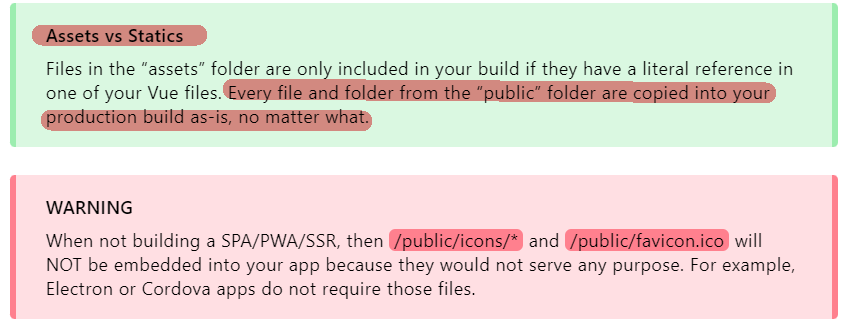

### Vue 仅绑定所需的静态资源

> 请注意，无论什么时候您将“src”绑定到Vue范围内的变量，此变量必须是来自静态文件夹 `\public`。 原因很简单：URL是动态的，所以Webpack（它在编译时打包资源）不知道在运行时将引用哪个文件，所以它不会处理URL。

简单记住，写img标签等 需要用 src 属性的时候，其路径一定是来自 `\public`的（因为webpack处理的资源最后是重新命名打包的，只有在打包好运行时，这种文件才有明确的url）

```vue
<template>
  <!-- imageSrc MUST reference a file from /public -->
  
</template>

<script>
export default {
  setup () {
    return {
      /*
        Referencing /public.
        Notice string doesn't start with a slash. (/)
      */
      imageSrc: 'logo.png'
    }
  }
}
</script>
```

> You can force serving static assets by binding `src` to a value with Vue. Instead of `src="path/to/image"` ==**use `:src=" 'path/to/image' "` or `:src="imageSrc"`**==. Please note the usage of single quotes within double quotes on the second code example (spaces have been added to see this visually on the documentation website - normally you would not have the spaces).
>
> 可以通过 vue 绑定，来强制指定路径，注意绑定之后，src里面要传入 字符串，也就是双层引号（双引号包裹单引号），或者，传入变量

### 在JavaScript中获取资源路径

> 为了让Webpack返回正确的资源路径，您需要使用 `require('./relative/path/to/file.jpg'）`，它将被`file-loader`处理并返回解析后的URL。 例如：
>
> ```js
> computed: {
>   background () {
>     return require('./bgs/' + this.id + '.jpg')
>   }
> }
> ```
>
> 请注意，上面的例子将包含最终版本中`./bgs/`下的所有图像。 这是因为Webpack无法猜测它们中的哪些将在运行时使用，所以它包含了它们全部。


### 🎯 资源路径总结

反正，如果遇到加载资源的问题，优先考虑是不是 webpack 打包导致的，试试  `require('./relative/path/to/file.jpg'）` 能不能解决


## Quasar App 启动流程

> 为了更好地理解插件的功能和用途，您需要了解您的网站/应用程序是如何启动的：
>
> 1. Quasar is initialized (components, directives, plugins, Quasar i18n, Quasar icon sets)
>
>    + Quasar初始化（组件，指令，插件，Quasar i18n，Quasar图标集）
>
> 2. Quasar Extras get imported (Roboto font – if used, icons, animations, …)
>
>    + Quasar Extras被导入（Roboto字体 - 如果使用，图标，动画…）
>
> 3. Quasar CSS & your app’s global CSS are imported
>
>    + Quasar CSS和您的应用程序的全局CSS被导入
>
> 4. App.vue is loaded (not yet being used)
>
>    + 根组件 App.vue被加载（尚未被使用）
>
> 5. Store is imported (if using Pinia in src/stores or Vuex in src/store)
>
>    + Store 被导入（如果使用 Pinia 则在 src/stores中，如果使用 Vuex 则在 src/store中）
>
> 6. Pinia (if using) is injected into the Vue app instance
>
>    + 如果使用 Pinia，则此时将 Pinia 注入到 Vue app 实例中
>
>    + > Pinia 是 Vue 的存储库，它允许您跨组件/页面共享状态。  
>      >
>      > [Home | Pinia 中文文档 (web3doc.top)](https://pinia.web3doc.top/)
>
> 7. Router is imported (in src/router)
>
>    + (在 src/router 中的)路由组件 被导入
>
> 8. Boot files are imported
>
>    + Boot files（启动文件/应用程序插件）被导入
>
> 9. Router default export function executed
>
>    + 路由组件中的默认导出函数被执行
>
> 10. Boot files get their default export function executed
>
>     + Boot files 中的默认导出函数被执行
>
> 11. (if on Electron mode) Electron is imported and injected into Vue prototype
>
>     + (如果在Electron模式下，)Electron 被导入并注入Vue原型
>
> 12. (if on Cordova mode) Listening for “deviceready” event and only then continuing with following steps
>
>     + （如果在Cordova模式下，）收听“deviceready”事件，然后继续执行以下步骤
>
> 13. Instantiating Vue with root component and attaching to DOM
>
>     + 使用根组件实例化Vue并附加到DOM
>
> —— [Quasar - boot files - Quasar App Flow](https://quasar.dev/quasar-cli-webpack/boot-files)


# Ref

+ [Quasar 最新版v2.7.0 英文文档](https://quasar.dev/quasar-cli-webpack/quasar-config-js) 【主要看这个文档】
  + 看了半天，终于知道从哪里看了，从 `Quasar CLI(With Webpack)` 这部分看起
  + 一开始我是看上古版本的中文文档，然后对比最新英文文档，才发现从👆这节看比较合适
  + 上古版本文档：http://v0-16.quasarchs.com/，他有个 1min 入门，点进去
+ [quasar 简介](https://blog.csdn.net/BDawn/article/details/102477936) 【旧版本】
+ [quasar 参考文档 ](https://www.cnblogs.com/q1104460935/p/15663108.html) 👍【旧版本】
+ [quasar-cli项目创建](https://blog.csdn.net/web_monkey888/article/details/119803934) 👍 【旧版本】
+ [quasar使用记录-安装配置](https://zhuanlan.zhihu.com/p/363921765) 【旧版本】
+ https://www.yuque.com/fictiony/cs6lwq/nzrxtl

