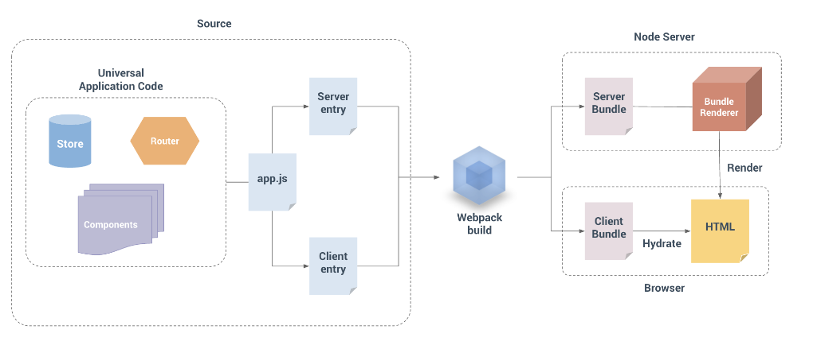

# Quasar SSR 开发

我整理的 Quasar SSR 笔记，前置笔记为 [Quasar-Learn.md](./Quasar-Learn.md)

绝大部分内容摘自官方文档[What is SSR | Quasar Framework](https://quasar.dev/quasar-cli-vite/developing-ssr/introduction)，本笔记贡献：

+ 对官方文档进行了重新排版（改善阅读顺序和知识补充）
+ 对中文译文进行了小部分优化（有些太机翻了不容易理解）
+ 增加了自己的笔记（理解、总结）

如果不想细究概念和原理，直接上手操作请直接跳到 <a href="#SSR 应用创建准备">SSR 应用创建准备</a> 这一节开始看

如需更快速的上手，直接看 <a href="#总结 & 其他">总结 & 其他</a> 一节即可

哦对了，主要是 Quasar CLI with Vite - SSR 开发（Webpack 其实基本一致的）

## SSR 基本概念

> Quasar and Vue.js are frameworks for building client-side applications. By default, Quasar Vue components produce and manipulate DOM in the browser as output. However, it is also possible to render the same components into HTML strings on the server, send them directly to the browser, and finally “hydrate” the static markup into a fully interactive app on the client.
>
> A server-rendered Quasar app can also be considered `isomorphic` or `universal`, in the sense that the majority of your app’s code runs on both the server and the client.

简单理解就是，Quasar、Vue 都是开发客户端程序的框架，但是是可以支持 SSR 模式的，并且SSR的代码应该是“同构”且“通用“的（指客户端和服务端代码同构通用）。

SSR(Server-Side Rendering, 服务器端渲染)，即在服务器上渲染网页，因此首次加载会更快，但是在不同页面之间导航都需要下载新的HTML内容。它的跨浏览器兼容性良好，但代价是页间加载时间延长，也就是总体感知上的性能降低：每加载一个页面，都需要一个服务器请求往返的时间。

简单来讲，SSR 就是在服务端渲染DOM结构，然后把HTML字符串发送给客户端浏览器，再由客户端浏览器呈现。

与 SSR 对应的就是 CSR：**客户端渲染（Client-Side Rendering, CSR）**允许在导航到不同页面时几乎立即在浏览器中更新网站，但在开始时需要更多的初始下载和客户端上的额外渲染。 首次访问时网站速度较慢，但后续访问速度要快得多。

## SSR 的优缺点

>较之于一个传统的 SPA (单页面应用)，SSR 主要的好处是：
>
>- **更好的搜索引擎优化 (SEO)**。因为搜索引擎爬虫会直接读取完整的渲染出来的页面。
>
>  注意，目前 Google 和 Bing 已经可以很好地为同步加载的 JavaScript 应用建立索引。在这里同步加载是关键。如果应用起始状态只是一个加载中的效果，而通过 API 调用获取内容，则爬虫不会等待页面加载完成。这意味着如果你的页面有异步加载的内容且 SEO 很重要，那么你可能需要 SSR。
>
>- **更快的内容呈现**，尤其是网络连接缓慢或设备运行速度缓慢的时候。服务端标记不需要等待所有的 JavaScript 都被下载并执行之后才显示，所以用户可以更快看到完整的渲染好的内容。这通常会带来更好的用户体验，同时对于内容呈现时间和转化率呈正相关的应用来说尤为关键。
>
>这里有一些是否选用 SSR 的取舍因素：
>
>- **开发一致性**。浏览器特有的代码只能在特定的生命周期钩子中使用；一些外部的库在服务端渲染应用中可能需要经过特殊处理。
>- **需要更多的构建设定和部署要求**。不同于一个完全静态的 SPA 可以部署在任意的静态文件服务器，服务端渲染应用需要一个能够运行 Node.js 服务器的环境。
>- **更多的服务端负载**。在 Node.js 中渲染一个完整的应用会比仅供应静态文件产生更密集的 CPU 运算。所以如果流量很高，请务必准备好与其负载相对应的服务器并采取明智的缓存策略。
>
>在应用中使用 SSR 之前，你需要问自己的第一个问题是：你是否真的需要它？它通常是由内容呈现时间对应用的重要程度决定的。例如，如果你正在搭建一个内部管理系统，几百毫秒的初始化加载时间对它来说无关紧要，这种情况下就没有必要使用 SSR。然而，如果内容呈现时间非常关键，SSR 可以助你实现最佳的初始加载性能。
>
>摘自：[服务端渲染指南 | Vue.js (vuejs.org)](https://v3.cn.vuejs.org/guide/ssr/introduction.html#什么是服务端渲染-ssr)

总结：

+ 优点：
  + **Better SEO**
  + **Faster time-to-content**
+ 缺点：
  + **Development constraints**
  + **More server-side load**

## 编写通用（同构）代码的注意事项

> 编写`通用`代码（也称为`同构`）意味着编写同时在服务器和客户端上运行的代码。 由于用例和平台API的不同，在不同环境中运行时，同样的代码行为将不完全相同。 因此有一些额外注意事项。
>
> 

### 服务器上的数据反应性

> 在仅客户端的应用程序中，每个用户都将在其浏览器中使用该应用程序的新实例。 对于服务器端渲染，我们希望做到这一点：每个请求都应该有一个新鲜的，隔离的应用程序实例，这样就不会出现跨请求状态污染。
>
> 因为实际的渲染过程需要确定性，所以我们还将在服务器上“预取”数据，这意味着当我们开始渲染时，我们的应用程序状态将已经解决。 这意味着**==服务器上不需要数据反应性，因此默认情况下将其禁用==**。 禁用数据反应性还避免了将数据转换为反应对象的性能成本。

简单理解：

+ 每个客户端浏览器中运行的是同一份应用代码的独自不同的实例，即不同用户不同应用实例
+ 各个应用实例之间应该相互隔离，不互相影响
  + 简单来说，就是用户A在应用中的任何操作，应该不影响到用户B（除非本身存在两者的交互模块）
+ 服务器警用数据反应性
  + 我的理解是，ssr是在服务端构建好DOM的，所以在发送给客户端时，页面的DOM结构状态已经是确定的，而在构建DOM时就已经从服务器预先拿去数据进行DOM构建了，所以不需要数据反应

### 组件生命周期钩子的问题【❗ 重要 ❗】

> 由于没有动态更新，因此在所有 Vue生命周期钩子中，在**==SSR期间仅会调用`beforeCreate`和`created`==**。 这意味着**==其他生命周期钩子内的任何代码（例如`beforeMount`或`mounted`）将仅在客户端上执行。==**
>
> 要注意的另一件事是，您应该避免在`beforeCreate`和`created`中产生全局副作用的代码，例如，使用`setInterval`设置计时器。 在仅客户端代码中，我们可以设置一个计时器，然后在`beforeDestroy`或`destroyed`中将其拆除。 但是，由于销毁钩子不会在SSR期间被调用，因此计时器将永远存在。 为了避免这种情况，请将副作用代码移到`beforeMount`或`mounted`中。
>
> > 注意，Vue 3 中生命周期函数更名了：
> >
> > - `destroyed` 生命周期选项被重命名为 `unmounted`
> > - `beforeDestroy` 生命周期选项被重命名为 `beforeUnmount`

### 避免有状态的单例

> 在编写**仅用于客户端的代码（clinet-only code）**时，我们习惯于每次都会在新的上下文中对我们的代码进行评估。 但是，Node.js 服务器是一个长期运行的进程。 当需要我们的代码进入流程时，它将被评估一次，然后保留在内存中。 这意味着，如果您创建一个单例对象，则它将在每个传入请求之间共享。
>
> 因此，==Quasar CLI**为每个请求创建新的根Vue实例（带新的Router和Vuex Store实例）**。== 这类似于每个用户在自己的浏览器中使用应用程序的新实例的方式。 如果我们将在多个请求之间使用共享实例，则很容易导致交叉请求状态污染。
>
> 与直接创建Router和Vuex Store实例不同，您将公开一个工厂函数，该函数可以重复执行从而为每个请求创建新的应用程序实例：
>
> > **👆 这部分还是看英文原文 👇 好理解：**
> >
> > When writing client-only code, we are used to the fact that our code will be evaluated in a fresh context every time. However, a Node.js server is a long-running process. When our code is required into the process, it will be evaluated once and then it stays in memory. This means if you create a singleton object, it will be shared between every incoming request.
> >
> > So, **==Quasar CLI creates a new root Vue instance with a new Router and Vuex Store instances for each request.==** This is similar to how **each user will be using a fresh instance of the app in their own browser.** If we would have used a shared instance across multiple requests, it will easily lead to cross-request state pollution.
> >
> > Instead of directly creating a Router and Vuex Store instances, you’ll be exposing a factory function that can be repeatedly executed to create fresh app instances for each request:
>
> ```js
> // src/router/index.js
> export default function (/* { store, ssrContext } */) {
>   const Router = new VueRouter({...}) // 注意可能 Vue Router v4 这里用法不一样
>   return Router
> }
> ```
>
> ```js
> // src/store/index.js
> export default function (/* { ssrContext } */) {
>   const Store = new Vuex.Store({...}) // 注意可能 Vuex 4 这里用法不一样
>   return Store
> }
> ```
>
> 如果您正在使用 Vuex模块，请不要忘记将状态导出为函数，否则将创建单例：
>
> ```js
> // src/store/myModule/state.js
> export default () => ({
>   ...
> })
> ```


### 访问特定于平台的API

> 通用代码不能假定能够访问特定于平台的API，因此，**如果您的代码直接使用==仅限浏览器的全局变量（例如“ window”或“ document”）==，则它们在Node.js中执行时会抛出错误**，反之亦然。
>
> > **==时刻注意， SSR 是在服务端构建DOM的，Node是没有 window、document 对象的==**
>
> ==对于服务器和客户端之间共享但使用不同平台API的任务，建议将特定于平台的实现包装在通用API中，==或使用为您完成此任务的库。 例如，[Axios](https://github.com/axios/axios)是一个HTTP客户端，它为服务器和客户端公开相同的API。
>
> ==对于仅浏览器的API，常见的方法是在**仅客户端的生命周期钩子中（即除了 beforeCreate、created之外的）**延迟访问它们。==

总结：

+ SSR 渲染实在 node 服务器端，任何如 window、document 等浏览器对象是不存在的
  + 因此，代码中应该避免直接使用这类对象，要放到客户端的生命周期钩子中使用
+ 操作浏览器对象的API 要放到客户端生命周期钩子中（即除了 beforeCreate、created之外的）延迟访问


### Boot 启动文件配置（指定boot file运行环境）

> 请注意，如果在编写第三方库时未考虑通用性，那么将其集成到服务器渲染的应用程序中可能会很棘手。 您*可以*通过模拟某些全局变量来使其工作，但是这样做可能会很麻烦，并且可能会干扰其他库的环境检测代码。
>
> 当您将第三方库添加到项目中时（通过 [Boot file](https://quasar.dev/quasar-cli-vite/boot-files))，请考虑它是否可以在服务器和客户端上运行。 **如果只需要在服务器上运行，或者仅在客户端上运行，则在quasar.conf.js中指定：**
>
> ```js
> // quasar.config.js
> return {
>   // ...
>   boot: [
>     'boot-file-A', // runs on both server & client, boot-file-A 可以在服务器和客户端都运行
>     { path: 'boot-file-B', server: false } // this boot file gets embedded only on client-side, boot-file-B 仅在客户端运行
>     { path: 'third', client: false } // this boot file gets embedded only on server-side，boot-file-C 仅在服务器运行
> 	// 注意，通过 false 禁用来实现 👆，不是通过 true 开启
>   ]
> }
> ```


### 数据预取和状态

> 在SSR期间，我们实质上是在渲染应用程序的“快照”，因此，**如果该应用程序依赖于一些异步数据，则在开始渲染过程之前，需要预先提取并解析此数据。**
>
> Quasar CLI的  [预读取功能(PreFetch Feature)](https://quasar.dev/quasar-cli-vite/prefetch-feature) 为解决此问题而创建。 花一些时间来阅读它。
>
> > + [旧版中文文档：预取功能](http://www.quasarchs.com/quasar-cli/prefetch-feature/)

数据预读取对 SSR 特别重要，下面对其进行介绍

**预取（PreFetch）功能**

> 预取是一项功能（**仅在使用Quasar CLI**时可用，即通过 Quasar CIL 创建、控制项目），它**允许 Vue路由 (在`/src/router/routes.js`定义) 获取的组件去：**
>
> - **预取数据**
> - **验证路由**
> - **当某些条件不满足时（如用户未登录），重定向到另一条路由**
> - **可以帮助初始化存储状态**
>
> **==以上所有内容都将在实际路由组件呈现之前运行。==**
>
> **它适用于所有Quasar模式**（SPA、PWA、SSR、Cordova、Electron），但它**==对SSR构建特别有用==**。

#### 启用 preFetch

直接通过 quasar 配置文件，开启即可

```js
// quasar.config.js
const { configure } = require('quasar/wrappers')
const path = require('path')
module.exports = configure(function (ctx) {
    return {
        // other configures ...
        preFetch: true // 配置这里
    }
}
```

> **WARNING**
>
> When you use it to pre-fetch data, you may want to use Pinia or Vuex, so make sure that your project folder has the `/src/stores` (for Pinia) **OR** `/src/store` (for Vuex) folders when you create your project, otherwise generate a new project and copy the store folder contents to your current project (or use `quasar new store` command).
>
> > 就是说得确保项目文件夹具有`/src/store`文件夹（用Vuex的话，Pinia为`/src/stores`），否则生成新项目并复制store文件夹内容到当前项目。

#### 预取功能如何帮助SSR模式

> 此功能对SSR模式特别有用（但不仅限于此）。在SSR期间，我们基本上渲染了我们应用程序的“快照”，因此==如果应用程序依赖于某些异步数据，**那么在开始渲染过程之前，需要预先获取并解析此数据**。==
>
> 另一个问题是在客户端上，在我们**安装客户端应用程序（即将服务器代码发送到客户端）**之前需要提供相同的数据 - 否则客户端应用程序将使用不同的状态呈现，并且**水化作用（原文是 hydration，解释见下方 👇）**将失败。
>
> > **Hydration：**
> >
> > **Hydration refers to the client-side process during which Vue takes over the static HTML sent by the server and turns it into dynamic DOM that can react to client-side data changes.**
> >
> > > 即在客户端处理过程中，Vue会接管服务器发送的静态HTML，并将其转换为可以对客户端数据更改做出反应的动态DOM。
> >
> > Since the server has already rendered the markup, we obviously do not want to throw that away and re-create all the DOM elements. Instead, we want to “hydrate” the static markup and make it interactive.
> >
> > > 由于服务器已经渲染了标记，因此我们显然不想扔掉标记并重新创建所有DOM元素。 因此，取而代之的是，我们要“水化”静态标记并使之具有交互性
> >
> > > **WARNING**
> > >
> > > 在开发模式下，Vue将断言客户端生成的虚拟DOM树与从服务器渲染的DOM结构匹配。 如果不匹配，它将阻止水化，丢弃现有的DOM并从头开始渲染。 **在生产模式下，将禁用此断言以实现最佳性能。**
> >
> > **==如果遇到：`“Vuejs Error - The client-side rendered virtual DOM tree is not matching server-rendered content”）`, 那么大概率是发生了 hydration 错误，可以参考 [这里](http://www.quasarchs.com/quasar-cli/developing-ssr/client-side-hydration/#%E5%A4%84%E7%90%86%E6%B0%B4%E5%8C%96%E9%94%99%E8%AF%AF) 进行解决==**
> >
> > 参考：[Client Side Hydration | Quasar Framework](https://quasar.dev/quasar-cli-vite/developing-ssr/client-side-hydration)
>
> 为了解决这个问题，**==所获取的数据需要存在于视图组件之外，专用数据存储或“状态容器”中==**。在服务器上，我们可以在渲染之前预先获取数据并将数据填充到存储中。在我们安装应用程序之前，客户端存储将直接获取服务器状态。

#### 当预取功能被激活时

> ==**`preFetch`钩子（在下一节中描述）由访问的路由决定 - 它也决定了渲染的组件。**==
>
> 实际上，给定路由所需的数据也是在该路由上渲染的组件所需的数据。 **因此将钩子逻辑仅置于路由组件内是很自然的（也是必需的）**。 这包括`/src/App.vue`，在这种情况下，它只会在app启动时运行一次。
>
> 让我们举一个例子来了解何时调用钩子。假设我们有这些路由，并且我们为所有这些组件编写了`preFetch`钩子：
>
> 路由规则列表：
>
> ```js
> // routes
> [
>   {
>     path: '/',
>     component: LandingPage
>   },
>   {
>     path: '/shop',
>     component: ShopLayout,
>     children: [
>       {
>         path: 'all',
>         component: ShopAll
>       },
>       {
>         path: 'new',
>         component: ShopNew
>       },
>       {
>         path: 'product/:name',
>         component: ShopProduct,
>         children: [{
>           path: 'overview',
>           component: ShopProductOverview
>         }]
>       }
>     ]
>   }
> ]
> ```
>
> 现在，让我们看看当用户一个接一个地按照下面指定的顺序访问这些路由时如何调用钩子。
>
> | 正在访问的路由                 | 调用的钩子                         | 观察                                                         |
> | :----------------------------- | :--------------------------------- | :----------------------------------------------------------- |
> | `/`                            | App.vue然后 LandingPage            | 自我们的应用程序启动以来，就调用了App.vue挂钩。              |
> | `/shop/all`                    | ShopLayout然后ShopAll              | -                                                            |
> | `/shop/new`                    | ShopNew                            | ShopNew是ShopLayout的子项，ShopLayout已经渲染，因此不再调用ShopLayout。 |
> | `/shop/product/pyjamas`        | ShopProduct                        | -                                                            |
> | `/shop/product/shoes`          | ShopProduct                        | Quasar注意到已经渲染了相同的组件，但是路由已经更新并且它有路由参数，所以它再次调用了钩子。 |
> | `/shop/product/shoes/overview` | ShopProduct然后ShopProductOverview | ShopProduct具有路由参数，因此即使已经渲染它也会被调用。      |
> | `/`                            | 登陆页面                           | -                                                            |

#### preFetch 钩子用法

> 钩子被定义为我们的路由组件上名为`preFetch`的自定义静态函数。
>
> > **==preFetch 是一个函数，在组件内调用==**
>
> 请注意，因为**在实例化组件之前将调用此函数，所以它无法访问`this`**。
>
> > **==preFtech() 在组件构建之前，所以没法访问 this（指向组件）==**

用法示例：

> ```vue
> <!-- some .vue component used as route -->
> <template>
>   <div>{{ item.title }}</div>
> </template>
> 
> <script>
> import { useStore } from 'vuex'
> 
> export default {
>   // our hook here
>   preFetch ({ store, currentRoute, previousRoute, redirect, ssrContext, urlPath, publicPath }) {
>     // fetch data, validate route and optionally redirect to some other route...
> 
>     // ssrContext is available only server-side in SSR mode
> 
>     // No access to "this" here
> 
>     // Return a Promise if you are running an async job
>     // Example:
>     return store.dispatch('fetchItem', currentRoute.params.id)
>   },
> 
>   setup () {
>     const $store = useStore()
> 
>     // display the item from store state.
>     const item = computed(() => $store.state.items[this.$route.params.id])
> 
>     return { item }
>   }
> }
> </script>
> ```
>
> > **TIP**
> >
> > If you are developing a SSR app, then you can check out the [ssrContext](https://quasar.dev/quasar-cli-vite/developing-ssr/ssr-context) Object that gets supplied server-side.
> >
> > 关于 preFetch 里面的拿到的 ssrContext 参数，可以参考上述链接 👆
>
> ```js
> // related action for Promise example
> // ...
> 
> actions: {
>   fetchItem ({ commit }, id) { // 上述组件内用到的 action
>     return axiosInstance.get(url, id).then(({ data }) => {
>       commit('a-certain-mutation', data)
>     })
>   }
> }
> 
> // ...
> ```
>
> > If you are using `<script setup>`, then add a `<script>` section besides it which simply returns an Object with the preFetch() method:
> >
> > ```html
> > <script>
> > export default {
> >   preFetch () {
> >     console.log('running preFetch')
> >   }
> > }
> > </script>
> > 
> > 
> > <script setup>....</script>
> > ```
> >
> > 这就是把 step() 拎到外边， `<script setup>` 是语法糖

#### 其他

更多其他的用法和示例，参考官方文档：

+ [PreFetch Feature - redirecting-example | Quasar Framework](https://quasar.dev/quasar-cli-vite/prefetch-feature#redirecting-example)
+ [【旧版】预取（PreFetch）功能 | Quasar Framework 中文网 (quasarchs.com)](http://www.quasarchs.com/quasar-cli/prefetch-feature/#重定向示例)


## SSR 应用创建准备

注意，这部分 Quasar V2 和 V1 相差比较大，可以参考这部分指南 [Upgrade guide on SSR | Quasar Framework](https://quasar.dev/quasar-cli-vite/developing-ssr/ssr-upgrade-guide#upgrading-from-quasar-v1)

以下笔记针对 Quasar V2 最新版（笔记写作于 2022.06.10）

> 我们将使用Quasar CLI开发和建立一个SSR网站。构建SPA、移动应用、Electron应用、PWA或SSR之间的区别仅仅由“quasar dev”和“quasar build”命令中的“mode”参数决定。
>
> 为了开发或建立SSR网站，我们首先需要在我们的Quasar项目中添加SSR模式：
>
> ```bash
> $ quasar mode add ssr
> ```
>
> 如果你想直接进入并开始开发，你可以跳过“quasar mode”命令并发出：
>
> ```bash
> $ quasar dev -m ssr
> ```
>
> 这将自动添加 SSR 模式（如果没有的话）。
>
> 命令执行后，会创建一个新文件夹（下节 SSR 配置 将会细讲）：
>
> ```shell
> .
> └── src-ssr/
>     ├── middlewares/  # SSR middleware files
>     └── server.js     # SSR webserver
>  
> # 注意低版本Quasar这里结构不一样，此处为当前最新Quasar 2的结构
> ```


## SSR 配置 【❗ 重要 ❗】

### 配置模板 【暂时只看这个就够了】

同 Quasar 的其他配置一样， SSR 功能也在 `quasar.config.js` 中进行，在 `ssr`节点内进行配置

> This is the place where you can configure some SSR options. Like if you want the client side to takeover as a SPA (Single Page Application – the default behaviour), or as a PWA (Progressive Web App).
>
> > 在 `ssr`节点内可以配置一些SSR选项。 就像您希望客户端以SPA（单页应用程序-默认行为）或PWA（渐进式Web应用程序）接管一样。
>
> ```js
> return {
>   // ...
>   ssr: {
>     ssrPwaHtmlFilename: 'offline.html', // do NOT use index.html as name!
>                                         // will mess up SSR
> 
>     extendSSRWebserverConf (esbuildConf) {},
> 
>     // add/remove/change properties 
>     // of production generated package.json
>     // 可选性配置👇： 添加/删除/更改生产版本, 生成的package.json的属性
>     extendPackageJson (pkg) {
>       // directly change props of pkg;
>       // no need to return anything
>     },
> 
>     pwa: false, // true：客户端由 PWA接管，默认值 false：客户端由 SPA 接管
> 
>     /**
>      * Manually serialize the store state and provide it yourself
>      * as window.__INITIAL_STATE__ to the client-side (through a <script> tag)
>      * (Requires @quasar/app-vite v1.0.0-beta.14+)
>      */
>     manualStoreSerialization: false,
> 
>     /**
>      * Manually inject the store state into ssrContext.state
>      * (Requires @quasar/app-vite v1.0.0-beta.14+)
>      */
>     manualStoreSsrContextInjection: false,
> 
>     /**
>      * Manually handle the store hydration instead of letting Quasar CLI do it.
>      * For Pinia: store.state.value = window.__INITIAL_STATE__
>      * For Vuex: store.replaceState(window.__INITIAL_STATE__)
>      */
>     manualStoreHydration: false,
> 
>     /**
>      * Manually call $q.onSSRHydrated() instead of letting Quasar CLI do it.
>      * This announces that client-side code should takeover.
>      */
>     manualPostHydrationTrigger: false,
> 
>     prodPort: 3000, // The default port that the production server should use
>                     // (gets superseded if ({}).PORT is specified at runtime)
> 
>     middlewares: [
>       'render' // keep this as last one
>     ]
>   }
> }
> ```
>
> > 如果使用PWA客户端接管（即`pwa: true`，**这是一个杀手组合**），那么也会安装Quasar CLI PWA模式。
> >
> > 具体参见：
> >
> > + [Quasar PWA](https://quasar.dev/quasar-cli-vite/developing-pwa/introduction) 
> > +  [SSR with PWA](https://quasar.dev/quasar-cli-vite/developing-ssr/ssr-with-pwa) 
>
> 如果你想修改 /src 中UI的Vite配置:
>
> ```js
> // quasar.config.js
> module.exports = function (ctx) {
>   return {
>     build: {
>       extendViteConf (viteConf, { isClient, isServer }) {
>         if (ctx.mode.ssr) {
>           // do something with ViteConf
>         }
>       }
>     }
>   }
> }
> ```

### 【可选】手动触发 store 水化（Manually triggering store hydration）

> By default, Quasar CLI takes care of hydrating the Vuex store (if you use it) on client-side.
>
> However, should you wish to manually hydrate it yourself, you need to set `quasar.config.js > ssr > manualStoreHydration: true`. One good example is doing it from [a boot file](https://quasar.dev/quasar-cli-vite/boot-files):
>
> > 就是说，默认情况下是在客户端侧处理水化的（Quasar CLI 自动管理得到），但是可以进行配置手动管理。【我感觉这个暂时用不到，可以先不细究】
> >
> > + 先在`quasar.config.js` 开启手动管理store的水化
> >
> > + ```js
> >   // quasar.config.js
> >   return {
> >       ssr: {
> >           // other configures ...
> >           manualStoreHydration: true
> >       }
> >   }
> >   ```
> >
> > + 然后通过 boot file 进行配置
> >
> >   ```js
> >   // boot_file_xxx
> >   // MAKE SURE TO CONFIGURE THIS BOOT FILE
> >   // TO RUN ONLY ON CLIENT-SIDE
> >   
> >   export default ({ store }) => {
> >     // For Pinia
> >     store.state.value = window.__INITIAL_STATE__
> >   
> >     // For Vuex
> >     store.replaceState(window.__INITIAL_STATE__)
> >   }
> >   ```
> >
> >   记得要为该 `boot_file_xxx` 开启客户端运行，回顾 <a href="#Boot 启动文件配置（指定boot file运行环境）">Boot 启动文件配置（指定boot file运行环境）</a>
> >
> >   ```js
> >   // quasar.config.js
> >   return {
> >        boot: [
> >            {path: 'boot_file_xxx', server: false}
> >        ]
> >   }
> >   ```

### 【可选】手动触发 post-hydration（Manually triggering post-hydration）

> By default, Quasar CLI wraps your App component and calls `$q.onSSRHydrated()` **on the client-side** when this wrapper component gets mounted. **This is the moment that the client-side takes over**. <u>You don’t need to configure anything for this to happen</u>.
>
> However should you wish to override the moment when this happens, you need to set `quasar.config.js > ssr > manualPostHydrationTrigger: true`. For whatever your reason is (very custom use-case), this is an example of manually triggering the post hydration:
>
> > 就是说，默认情况下 Quasar CLI 自动封装App组件，然后自动在客户端调用`$q.onSSRHydrated()`执行客户端接管的
> >
> > 但是，可以通过配置 `manualPostHydrationTrigger: true` 手动接管，然后自己写 `$q.onSSRHydrated()` 的调用，这样就可以控制执行时机了。
> >
> > 【我感觉这个暂时用不到，可以先不细究】
>
> ```js
> // 组合式API 写法
> // App.vue - Composition API
> 
> import { onMounted } from 'vue'
> import { useQuasar } from 'quasar'
> export default {
>   // ....
>   setup () {
>     // ...
>     const $q = useQuasar()
>     onMounted(() => {
>       $q.onSSRHydrated()
>     })
>   }
> }
> ```
>
> ```js
> // 传统选项式API 写法
> // App.vue - Options API
> export default {
>   mounted () {
>     this.$q.onSSRHydrated()
>   }
> }
> ```

### Nodejs 服务器（就是 SSR 模式下的服务器来源）

> Adding SSR mode to a Quasar project means a new folder will be created: `/src-ssr`, which contains SSR specific files:
>
> ```bash
> .
> └── src-ssr/
>     ├── middlewares/  # SSR middleware files
>     └── server.js     # SSR webserver
> ```
>
> **You can freely edit these files.** Each of the two folders are detailed in their own doc pages (check left-side menu).
>
> > 这两文件的配置，会在之后的 SSR Middlewar 和 SSR Webserver 小节中提到
>
> Notice a few things:
>
> 1. These files run in a Node context (they are NOT transpiled by Babel), so use only the ES6 features that are supported by your Node version. (https://node.green/)
>
>    > 些文件在Node上下文中运行（Babel不会编译它们），因此请仅使用Node版本支持的ES6功能。
>
> 2. If you import anything from node_modules, then make sure that the package is specified in package.json > “dependencies” and NOT in “devDependencies”.
>
>    > 如果从node_modules导入任何内容，请确保在package.json>dependencies中指定了该包，而在devDependencies中未指定。
>
> 3. The `/src-ssr/middlewares` is built through a separate Esbuild config. You can extend the Esbuild configuration of these files through quasar.config.js:
>
>    ```js
>    return {
>      // ...
>      ssr: {
>        // ...
>        extendSSRWebserverConf (esbuildConf) {
>          // tamper with esbuildConf here
>        },
>      }
>    }
>    ```
>
> 4. The `/src-ssr/server.js` file is detailed in [SSR Webserver](https://quasar.dev/quasar-cli-vite/developing-ssr/ssr-webserver) page. Read it especially if you need to support serverless functions.

### SEO 支持配置

> 开发SSR而不是SPA的主要原因之一是要注意SEO。 通过使用 [Quasar Meta Plugin](https://quasar.dev/quasar-plugins/meta) 管理搜索引擎所需的动态html标记，可以大大改善SEO。
>
> 参考：旧版本链接 [Quasar Meta插件](http://www.quasarchs.com/quasar-plugins/meta)


## ssrContext 【❗ 重要 ❗】

> The `ssrContext` Object is the SSR context with which all the app’s Vue components are rendered with.

### 用法

> > WARNING
> >
> > The `ssrContext` Object is available only on SSR builds, on the server-side compilation (when `false === true`).
>
> Among other places, it is supplied as parameter to [boot files](https://quasar.dev/quasar-cli-vite/boot-files), to the [Vuex store](https://quasar.dev/quasar-cli-vite/state-management-pinia-vuex) and [Vue Router](https://quasar.dev/quasar-cli-vite/routing) initialization functions, and to the [preFetch](https://quasar.dev/quasar-cli-vite/prefetch-feature) method:
>
> > **就是说，ssrContext 变量可以在 boot file、Vuex store、Vue Router 文件中，以及 preFetch() 函数内使用**
>
> ```js
> // a boot file
> export default ({ ..., ssrContext }) => { /* ... */ }
> 
> // src/router/index.[js|ts]
> export default ({ ..., ssrContext }) { /* ... */ }
> 
> // src/store/index.[js|ts]
> export default ({ ..., ssrContext }) { /* ... */ }
> 
> // with preFetch:
> preFetch ({ ..., ssrContext }) { /* ... */ }
> ```
>
> You can also access the ssrContext in your Vue components. Below are two examples, one with Composition API and one with Options API:
>
> > ssrContext 变量也可以在 Vue 组件中直接使用，下面是两种写法
>
> 组合式API 写法
>
> ```js
> // Composition API
> // 某个组件内
> import { useSSRContext } from 'vue'
> 
> export default {
>   // ...
>   setup () {
>     // we need to guard it and call it only on SSR server-side:
>     const ssrContext = process.env.SERVER ? useSSRContext() : null
>     // ...do something with it
>   }
> }
> ```
>
> 传统选项式API 写法：
>
> ```js
> // Options API
> // 某个组件内
> export default {
>   // ...
>   created () { // can be any other Vue component lifecycle hook
>     this.ssrContext
>   }
> }
> ```

### ssrContext 对象结构

```js
ssrContext: {
  req,        // Express.js object  👈👈👈
  res,        // Express.js object // 👈 👆这俩就是 Express 的请求、响应对象
  $q,         // The Quasar's $q Object
  state,      // The Vuex state (ONLY if using the Vuex store)

  nonce,      // (optional to set it yourself)
              // The global "nonce" attribute to use

  onRendered, // Registers a function to be executed server-side after
              // app has been rendered with Vue. You might need this
              // to access ssrContext again after it has been fully processed.
              // Example: ssrContext.onRendered(() => { /* ... */ })

  rendered    // (optional to set it yourself)
              // Set this to a function which will be executed server-side
              // after the app has been rendered with Vue.
              // We recommend using the "onRendered" instead.
              //
              // Purpose: backward compatibility with Vue ecosystem packages
              // (like @vue/apollo-ssr)
              // Example: ssrContext.rendered = () => { /* ... */ }
}
```

> More information on the purpose of the “nonce” property is available on [MDN](https://developer.mozilla.org/en-US/docs/Web/HTML/Global_attributes/nonce).
>
> **The `req` and `res` are Express.js’s objects for the current server client.** One use-case for `req` is accessing `req.url` to get the URL that the client is requesting.
>
> > **TIP**
> >
> > Feel free to inject your own stuff into ssrContext too, but do NOT tamper with any of the private props (props that start with an underscore, eg. `_someProp`).

那么可以看到，Quasar SSR 模式，默认时使用 Express 作为服务器


## SSR 构建命令

### Developing

```bash
$ quasar dev -m ssr

# ..or the longer form:
$ quasar dev --mode ssr
```

### Building for Production

```bash
$ quasar build -m ssr

# ..or the longer form:
$ quasar build --mode ssr
```

If you want a production build with debugging enabled:

```bash
$ quasar build -m ssr -d

# ..or the longer form
$ quasar build -m ssr --debug
```


## 总结 & 其他

总结一下 Quasar SSR 的开发：

+ 代码同构的，因此只要避免在 created 生命周期之前使用到 window 等浏览器对象，其余代码可以保持不变
  + 记住 created 生命周期之前是 server-side 处理的，created 之后是 client-side 处理的
  + server-side 是 node 环境（无如 window 等浏览器对象），client-side 就是浏览器环境
+ 然后一些异步数据可能要预读取，是需要用 preFetch 处理的，参见 <a href="#preFetch 钩子用法"> preFetch 钩子用法 </a> 一节
+ 直接使用 `quasar dev -m ssr` 就可以自动创建 ssr 对象的文件夹，然后自动运行 ssr 模式，基本不用太多操作
+ 如果 boot file 中有用到浏览器对象的且可以只运行在客户端侧的，记得在`quasar.config.js` 中把该 boot file 配成 `server: false`，让它只运行在客户端侧即可

至于SSR 其他的知识，暂时可以先不深入，直接查阅文档按需学习即可

本笔记后续的官方章节：[SSR Middleware | Quasar Framework](https://quasar.dev/quasar-cli-vite/developing-ssr/ssr-middleware)


