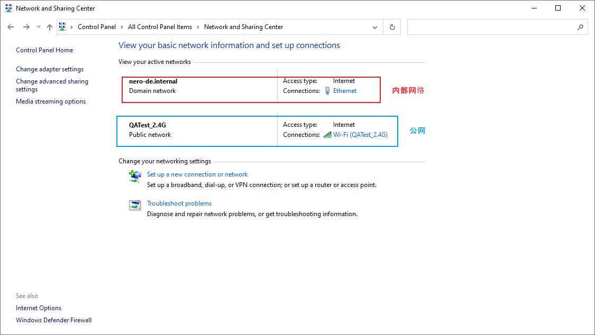
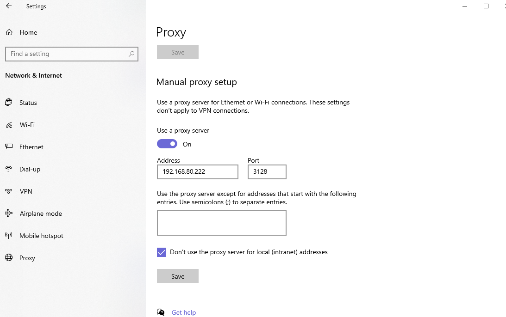
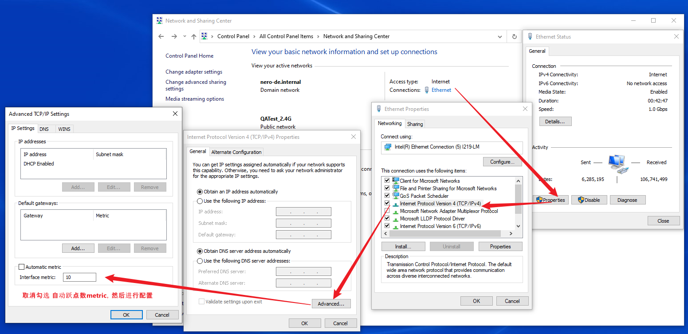

# 网络问题



一些内部网址，只能在内网环境下访问（发现内网可以直接访问github页面，但是git命令没法push clone，需要公网才可以访问）

本来想试试配VPN，但是公司的内网是直接配了代理的



然后配置小飞机啥的，都绕不出去，问网络管理员，他说他们配置了防火墙啥的，外网用无向网卡访问。

那就配置网络优先级，参考 [Windows10设置有线/无线网络优先级的方法](http://www.360doc.com/content/21/0112/09/66598049_956441801.shtml)



配置跃点数，跃点数越小，优先级别越高，这里wifi（公网配置10），有线（内网配20）

> 然后发现访问内网网址还是加载不开，然后我发现把内网也配10，两个都配10，就可以了，内网也可以快速打开，同时git命令也可以正常执行

## 后续-最终解决方案

哎，还是得用有线

于是配置npm

```shell
npm config set proxy=http://192.168.80.222:3128
```

git 代理先不配置

因为工作仓库得用内网，github上的仓库是走外网

可以单独配置 git 代理，方案：

+ 方案一：每个独立的repo 配置代理，就是不配置全局的代理，这样公司内部仓库就不走代理

+ 方案二：直接为走githhub的仓库配置全局代理

  + 采用这个

  + ```
    //只对github.com使用代理，其他仓库不走代理
    git config --global http.https://github.com.proxy http://192.168.80.222:3128
    git config --global https.https://github.com.proxy https://192.168.80.222:3128
    ```

  + 参考：https://blog.csdn.net/qq_34147601/article/details/118305793

这样直接不用无线网络卡就好了

